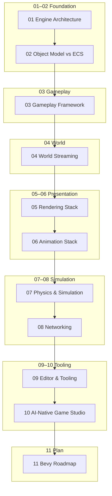
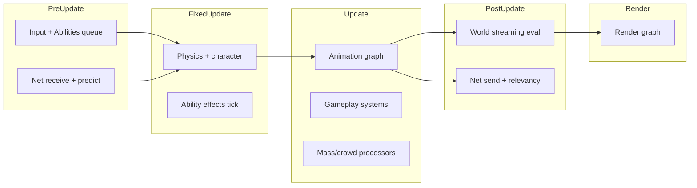

# Unreal-to-Bevy Architecture Atlas — Overview

> **⚠️ RESEARCH ONLY** — Normative specs: [`docs/specs/README.md`](../../specs/README.md)

> **Clean-room research document.** Concepts and responsibilities extracted from Unreal Engine 5 architecture and mapped to original Bevy/Rust designs. No UE source code is reproduced here.

## Purpose

This atlas is a senior-engineering reference for building an **open-source, Rust/Bevy-based AA game engine stack** inspired by UE5's *capabilities*, not its implementation. Each chapter answers:

1. What UE5 provides and why it exists
2. How systems interact at runtime and in tooling
3. What Bevy offers today (as of 0.16+, ecosystem ~0.18)
4. What we must build for MVP and AA quality
5. Suggested Rust crate boundaries

## Research Sources

| Source | Used for |
|--------|----------|
| Local UE5 tree: `Engine/Source/`, `Engine/Plugins/`, `Samples/Games/Lyra/` | Module layout, headers, READMEs, config |
| [UE5 Official Docs](https://docs.unrealengine.com) | Conceptual documentation |
| [GAS Plugin README](Engine/Plugins/Runtime/GameplayAbilities/README.md) | Gameplay Ability System |
| [Bevy 0.16 Release](https://bevy.org/news/bevy-0-16/) | Current Bevy capabilities |
| Bevy ecosystem crates | Physics, networking, editor gaps |

**Not in local tree:** City Sample (separate Marketplace download). Claims about City Sample are marked *external reference*.

## Atlas Map



## Document Index

| # | File | UE5 Focus | Bevy Target |
|---|------|-----------|-------------|
| 00 | `00_overview.md` | This document | Navigation |
| 01 | `01_engine_architecture.md` | Modules, plugins, UBT, config, assets | Workspace crates, plugins, build, config |
| 02 | `02_object_model_vs_ecs.md` | UObject, Actor, Component | ECS entities, scenes, reflection |
| 03 | `03_gameplay_framework.md` | GAS, tags, input, Lyra patterns | Ability system, modular gameplay |
| 04 | `04_world_streaming.md` | World Partition, data layers, Mass | Sector streaming, crowds |
| 05 | `05_rendering_stack.md` | Nanite, Lumen, VSM, materials | wgpu pipeline, virtual geometry |
| 06 | `06_animation_stack.md` | AnimBP, Control Rig, motion matching | Animation graph crate |
| 07 | `07_physics_simulation.md` | Chaos, CMC, vehicles, ragdolls | Rapier abstraction layer |
| 08 | `08_networking.md` | Replication, Iris, ReplicationGraph | Lightyear-style stack |
| 09 | `09_editor_tooling.md` | Blueprint, Sequencer, Niagara editors | AI-native editor shell |
| 10 | `10_ai_native_game_studio.md` | N/A (greenfield) | Agent-driven dev loop |
| 11 | `11_bevy_roadmap.md` | N/A | Phased implementation plan |

### Implementation Layer (start here when building)

| # | File | Purpose |
|---|------|---------|
| 12 | `12_integration_blueprint.md` | End-to-end wiring, boot sequence, entity graph |
| 13 | `13_data_schemas.md` | RON/TOML schemas for every asset type |
| 14 | `14_system_schedule_spec.md` | Canonical Bevy system ordering |
| 15 | `15_phase0_bootstrap_guide.md` | Step-by-step workspace creation |
| 16 | `16_anti_patterns_and_decisions.md` | DO NOT list + ADRs |
| 17 | `17_agent_cli_contract.md` | CLI/MCP contract for Cursor-like app |
| — | `AGENTS.md` | Copy to project root for AI assistants |

## Recommended Build Path

```
Study 00–02 (concepts)
  → Read 12 (integration)
  → Read 13–14 (schemas + schedules)
  → Follow 15 (bootstrap workspace)
  → Keep 16 open during all coding
  → Wire agent via 17 + AGENTS.md
  → Execute phases in 11
```

## Core Architectural Divergence

UE5 and Bevy make opposite foundational bets:

| Dimension | UE5 | Bevy (proposed stack) |
|-----------|-----|----------------------|
| **Identity** | `UObject` + `UClass` reflection | Entity ID + typed components |
| **Composition** | `AActor` owns `UActorComponent[]` | ECS archetypes + bundles |
| **Scripting** | Blueprint visual graphs | Rust + optional DSL/WASM |
| **Editor** | Monolithic Unreal Editor | Composable editor plugins + AI agents |
| **Networking** | Built-in replication + Iris | Ecosystem (e.g. `lightyear`) + custom components |
| **Content** | `.uasset` binary packages | Asset pipeline (gltf, ron/toml, bevy assets) |
| **Scale** | World Partition + Mass Entity | Sector loader + optional ECS crowd layer |

**Design principle:** Do not bolt Actors onto Bevy. Build **ECS-native equivalents** that achieve the same *responsibilities*.

## Responsibility Translation Table

| UE5 Responsibility | UE5 Home | Bevy Equivalent (proposed) |
|--------------------|----------|----------------------------|
| Object identity + GC | `CoreUObject` | Entity + `Handle<T>` + explicit lifetimes |
| Scene placement | `AActor` / `USceneComponent` | `Transform` + `Parent` + `Children` |
| Modular behavior | `UActorComponent` | Components + systems |
| Data-driven abilities | GAS (`AbilitySystemComponent`) | `game_ability` crate |
| World streaming | `UWorldPartition` | `world_stream` crate |
| High-density agents | `MassEntity` | Dedicated crowd ECS or sub-world |
| Global illumination | Lumen (Renderer) | Integrate or build GI pass (long-term) |
| Micro-poly meshes | Nanite (Renderer) | Bevy Virtual Geometry (experimental) |
| Visual scripting | Blueprint | Rust hot-reload + graph DSL (optional) |
| VFX authoring | Niagara | `vfx_graph` crate or integrate `bevy_hanabi` |
| Replication | Iris + property replication | Component replication via `lightyear` patterns |

## AA Engine Stack — Target Crate Topology

```
aa_engine/                          # Workspace root
├── crates/
│   ├── aa_core/                    # App shell, schedules, config
│   ├── aa_reflect/                 # Type registry, serialization, hot-reload
│   ├── aa_scene/                   # Scenes, prefabs, spawn API
│   ├── aa_gameplay/                # GameMode, pawn, player state equivalents
│   ├── aa_ability/                 # GAS-inspired ability framework
│   ├── aa_tags/                    # Hierarchical gameplay tags
│   ├── aa_input/                   # Enhanced-input-style mapping
│   ├── aa_world_stream/            # Sector streaming, data layers
│   ├── aa_crowd/                   # Mass-inspired batch simulation
│   ├── aa_render/                  # Renderer extensions (GI, VSM, etc.)
│   ├── aa_animation/               # Animation graph runtime
│   ├── aa_physics/                 # Rapier facade + character controller
│   ├── aa_net/                     # Replication, prediction, relevancy
│   ├── aa_assets/                  # Import, validation, cook pipeline
│   └── aa_editor/                  # Editor shell (eframe/egui or custom)
├── tools/
│   ├── aa_cli/                     # Project commands, cook, validate
│   └── aa_agent/                   # AI agent integration (indexer, repair)
└── examples/
    └── lyra_equivalent/            # Reference game (modular experiences)
```

## Maturity Ladder (used in all chapters)

| Tier | Definition | Timeline hint |
|------|------------|---------------|
| **MVP** | Single-player vertical slice; one platform; minimal editor | 3–6 months (small team) |
| **AA** | Multiplayer, streaming open world, tooling, content pipeline | 18–36 months |
| **UE5 parity** | Not a goal — selective feature parity only |

## Cross-Cutting Runtime Schedule (proposed Bevy)



## Legal & Methodology

- **Clean-room:** Study UE5 docs, headers, and module boundaries locally (`/Users/franklinakpu/Downloads/UnrealEngine-release`). Extract *ideas* only.
- **No API cloning:** Proposed Bevy APIs in this atlas are *architectural sketches*, not stable interfaces.
- **Uncertainty:** Sections marked `unknown / needs source inspection` require deeper UE header reading or Epic docs.

## How to Read Each Chapter

Every chapter (01–11) follows this template:

| Section | Content |
|---------|---------|
| What UE5 Provides | Capability summary with local path citations |
| Why It Exists | Design motivation |
| Core Concepts | Data structures (conceptual) |
| Runtime Flow | Diagrams + step sequence |
| Editor/Tooling Flow | Authoring pipeline |
| Bevy Today | Existing crates/features |
| Gap Analysis | Build vs integrate |
| MVP / AA | Scoped deliverables |
| Risks | Hard problems |
| Crate Boundaries | Suggested modules |

## Next Steps

1. Read `01_engine_architecture.md` for workspace and build topology.
2. Read `02_object_model_vs_ecs.md` before designing any gameplay code.
3. Read `12_integration_blueprint.md` — the master wiring diagram.
4. Follow `15_phase0_bootstrap_guide.md` to create the workspace.
5. Copy `AGENTS.md` to your project root before using Cursor.
6. Use `11_bevy_roadmap.md` for phased execution order.

---

*Generated from clean-room analysis of UE5 source tree (release branch) and Bevy 0.16+ public documentation.*
