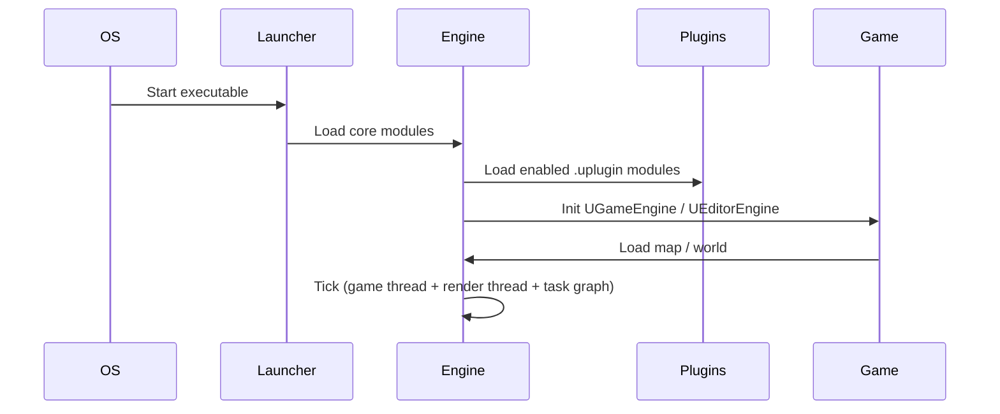
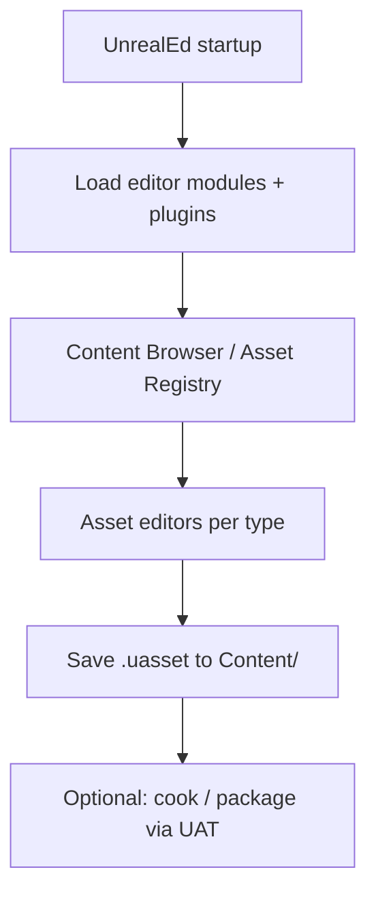

# 01 — Engine Architecture

## What UE5 Provides

UE5 is organized as a **modular monorepo** with strict separation between runtime, editor, developer tooling, and standalone programs.

### Source Tree Topology

```
UnrealEngine-release/
├── Engine/
│   ├── Source/
│   │   ├── Runtime/      (~188 modules) — shipped in games
│   │   ├── Editor/       (~143 modules) — editor-only
│   │   ├── Developer/    (~131 modules) — cook, DDC, IoStore
│   │   ├── Programs/     (~89) — UBT, UHT, AutomationTool
│   │   └── ThirdParty/   (~156) — vendored libs
│   ├── Plugins/          (~777 plugins, 63 category folders)
│   ├── Config/           — layered INI defaults
│   ├── Build/            — platform scripts, git deps
│   ├── Shaders/          — shared HLSL
│   └── Programs/         — tool entry points
├── Samples/Games/Lyra/   — reference game
└── Templates/TP_*/       — project scaffolds
```

**Local references:**
- Runtime hub: `Engine/Source/Runtime/Engine/`
- Editor hub: `Engine/Source/Editor/UnrealEd/`
- Build tool: `Engine/Source/Programs/UnrealBuildTool/`
- Config layering: `Engine/Source/Runtime/Core/Public/Misc/ConfigHierarchy.h`

### Runtime vs Editor vs Developer

| Layer | Target | Loaded when | Examples |
|-------|--------|-------------|----------|
| **Runtime** | Game + Editor core | Always (game or editor play) | `Core`, `CoreUObject`, `Engine`, `Renderer` |
| **Editor** | `TargetType.Editor` | Editor only | `UnrealEd`, `LevelEditor`, `MaterialEditor` |
| **Developer** | Build/cook pipeline | Development builds | `DerivedDataCache`, `IoStoreUtilities` |
| **Programs** | CLI executables | On demand | `UnrealBuildTool`, `UnrealHeaderTool`, `ShaderCompileWorker` |

### Plugin System

Plugins are first-class distribution units (~777 in tree). Example manifest: `Engine/Plugins/EnhancedInput/EnhancedInput.uplugin`.

| Plugin part | Role |
|-------------|------|
| `.uplugin` JSON | Metadata, module list, dependencies, content flag |
| `Source/{Module}/` | C++ with own `{Module}.Build.cs` |
| `Config/` | Plugin INI layers |
| `Content/` | Optional assets (`CanContainContent`) |

**Module host types** (from UBT `ModuleDescriptor.cs`): `Runtime`, `Editor`, `UncookedOnly`, `CookedOnly`, `DeveloperTool`, `Program`, `ServerOnly`, `ClientOnly`.

### Build System (UBT)

| Concept | Description |
|---------|-------------|
| **Module** | Smallest compile unit; `{Name}.Build.cs` declares deps |
| **Target** | `{Name}.Target.cs` — Editor, Game, Client, Server, Program |
| **UHT** | Parses `UCLASS`/`USTRUCT`; generates reflection glue |
| **UAT** | Cooks, stages, packages for shipping |
| **Unity builds / PCH** | Compile-speed batching per module |

**Build flow:** UBT reads target → resolves module graph → UHT → platform compile → binaries in `Binaries/`.

### Config System

10-layer INI hierarchy (engine + project + platform + user). Key files in `Engine/Config/`:

| File | Domain |
|------|--------|
| `BaseEngine.ini` | Maps, HTTP, rendering defaults |
| `BaseGame.ini` | Gameplay defaults |
| `BaseEditor.ini` | Editor behavior |
| `BaseScalability.ini` | Quality presets |
| `BaseDeviceProfiles.ini` | Device tiers |
| `ConsoleVariables.ini` | Default CVars |

Project overrides: `{Project}/Config/DefaultEngine.ini`, `DefaultGame.ini`, etc.

Plugin configs merge via `PluginBase.ini` → plugin `Base*.ini` → project overrides.

### Asset / Content Organization

| Location | Role |
|----------|------|
| `Engine/Content/` | Engine assets (git-dep, not in source-only checkout) |
| `{Project}/Content/` | Game `.uasset` / `.umap` |
| `{Plugin}/Content/` | Plugin-owned assets |

**Pipeline stages:**


| Stage | Module |
|-------|--------|
| Discovery | `Engine/Source/Runtime/AssetRegistry/` |
| DDC | `Engine/Source/Developer/DerivedDataCache/` |
| Cook | UAT + `CookedEditor` |
| Package | `IoStoreUtilities`, `PakFile`, `UnrealPak` |
| Runtime | `PakFile`, `AssetRegistry` |

---

## Why It Exists

| Design choice | Motivation |
|---------------|------------|
| **Strict Runtime/Editor split** | Ship smaller game binaries; editor code never in retail builds |
| **Module graph** | Incremental compile; enforce dependency direction |
| **Plugins** | Optional features without bloating core; marketplace distribution |
| **UBT + UHT** | Single build orchestration; reflection codegen from annotations |
| **Layered INI** | Platform + project + user overrides without code changes |
| **Cook pipeline** | Strip editor data; platform-specific formats; fast runtime load |
| **DDC** | Amortize expensive imports (mesh LOD, texture compression) |

---

## Core Concepts (UE5)

### Targets and Module Rules

```
UnrealEditor.Target.cs  → builds ALL editor modules
UnrealGame.Target.cs    → cooked game executable
{Project}.Target.cs     → game-specific target
{Module}.Build.cs       → Public/Private dependency lists
```

### Content Addressing

- Assets are `UObject`-serialized packages (`.uasset`, `.umap`)
- `AssetRegistry` indexes metadata without full load
- `PrimaryAssetId` / `PrimaryAssetType` for manager-driven loading (used heavily in Lyra)

### Programs Ecosystem

| Program | Role |
|---------|------|
| `UnrealBuildTool` | Compile orchestration |
| `UnrealHeaderTool` | Reflection codegen |
| `AutomationTool` | CI, cook, deploy |
| `ShaderCompileWorker` | Async shader compile |
| `UnrealPak` | Package creation |

---

## Runtime Flow



**Per-frame (simplified):**
1. Game thread: world tick, components, physics, networking
2. Render thread: scene proxies → `DeferredShadingRenderer`
3. Task graph: parallel work (animation, cloth, etc.)
4. RHI: GPU submission

---

## Editor / Tooling Flow



Key editor modules:
- `LevelEditor` — viewport, placement
- `ContentBrowser` — asset discovery
- `PropertyEditor` — details panel (reflection-driven)
- `Kismet` / `BlueprintGraph` — visual scripting
- Per-asset editors: `MaterialEditor`, `Persona`, `Sequencer`, etc.

---

## What Bevy Already Has

| UE5 concept | Bevy equivalent (0.16+) |
|-------------|-------------------------|
| Module | Crate (`bevy_ecs`, `bevy_render`, etc.) |
| Plugin | `Plugin` trait + `App::add_plugins` |
| Target (Game vs Editor) | Cargo features (`default`, `editor`, `dev`) |
| Config INI | None built-in; use `ron`/`toml` + `bevy_common` patterns |
| Asset pipeline | `bevy_asset` + `AssetServer` + loaders |
| Reflection | Limited; `bevy_reflect` for components, no full UObject equivalent |
| Cook pipeline | None; assets loaded directly or pre-processed externally |
| Shader compile | `naga` + `bevy_shader` at build/runtime |
| Schedules | `Schedule`, `SystemSet`, explicit ordering (stronger than UE tick groups) |

**Bevy workspace** (from [bevy.org](https://bevy.org)): ~40+ first-party crates under single repo; optional `no_std` on many crates.

---

## What We Need to Build

| Gap | Priority | Notes |
|-----|----------|-------|
| **Workspace layout** | P0 | `aa_engine` workspace with feature-gated editor crates |
| **Config system** | P0 | Layered TOML/RON: `base → project → platform → user` |
| **Asset cook pipeline** | P1 | Strip editor metadata; platform blobs; manifest |
| **Derived data cache** | P1 | Hash-keyed artifact store for imports |
| **Editor/runtime feature split** | P0 | `#[cfg(feature = "editor")]` + separate binaries |
| **Plugin manifest** | P1 | `.aa_plugin.toml` with deps, capabilities, content roots |
| **CLI tooling** | P0 | `aa_cli`: build, run, cook, validate |
| **Primary asset manager** | P1 | Addressable-style loading (Lyra pattern) |

---

## Minimum Viable Version (MVP)

| Deliverable | Scope |
|-------------|-------|
| Cargo workspace | `aa_core`, `aa_scene`, `aa_assets`, `aa_gameplay` |
| Config | Single `project.toml` + `engine.toml` merge |
| Assets | glTF + RON prefabs; hot reload in dev |
| Build | `cargo run` for game; `cargo run -p aa_editor` for tools |
| Plugins | Rust crate plugins via `App::add_plugins` only |
| No cook | Dev assets loaded directly |

**Checklist:**
- [ ] Workspace `Cargo.toml` with shared versions
- [ ] `aa_core::AppPlugin` boot sequence
- [ ] TOML config loader with env overrides
- [ ] Asset manifest JSON per directory
- [ ] `aa_cli new / run / check` commands
- [ ] Feature flag `editor` gates egui panels

---

## AA-Quality Version

| Deliverable | Scope |
|-------------|-------|
| Full config hierarchy | Platform profiles, scalability presets, CVars |
| Cook pipeline | Headless cook command; IoStore-like bundle (custom format) |
| DDC | Content-addressed cache with SQLite index |
| Plugin SDK | Third-party `.aa_plugin` with WASM or dylib option |
| Automation | CI cook + shader warm + validation gates |
| Multi-target | Desktop + console cross-compile story |
| Zen-like shared cache | Optional remote DDC for teams |

---

## Risks and Hard Parts

| Risk | Severity | Mitigation |
|------|----------|------------|
| No UHT equivalent | High | Invest in `aa_reflect` + proc macros; accept Rust compile times |
| Asset cook complexity | High | Start with "dev = shipped format"; defer platform-specific cooks |
| Editor/runtime coupling | Medium | Strict crate boundaries; `aa_editor` depends on `aa_core`, never reverse |
| Plugin ABI stability | Medium | Versioned trait objects; prefer compile-time plugins initially |
| Shader permutation explosion | High | Material cache + limited master shaders (UE MaterialCache pattern) |

---

## Suggested Rust Crate / Module Boundaries

```
aa_core/
├── app/           # App builder, default plugins, schedules
├── config/        # Layered config merge (engine + project + user)
├── cvar/          # Runtime console variables
└── plugin/        # Plugin trait + manifest loader

aa_build/          # build.rs helpers, shader embedding
aa_assets/
├── loader/        # bevy_asset loaders (gltf, ron, audio)
├── registry/      # Asset discovery (AssetRegistry equivalent)
├── ddc/           # Derived data cache
└── cook/          # Headless cook pipeline

aa_cli/            # Commands: new, run, cook, package, validate

aa_editor/         # feature = "editor" only
├── shell/         # Docking UI (egui / future)
├── content/       # Asset browser
└── settings/      # Project settings UI
```

### Cargo Features (mirror UE TargetType)

```toml
[features]
default = ["game"]
game = []
editor = ["game", "aa_editor"]
server = ["game", "aa_net/server"]
client = ["game", "aa_net/client"]
dev = ["editor", "hot_reload"]
```

### Config File Layout (proposed)

```
project/
├── aa.project.toml      # Project metadata, plugins, maps
├── config/
│   ├── engine.toml      # → DefaultEngine.ini
│   ├── game.toml        # → DefaultGame.ini
│   ├── input.toml       # → DefaultInput.ini
│   ├── scalability.toml # → BaseScalability.ini
│   └── platforms/
│       └── windows.toml
└── assets/              # → Content/
```

---

## UE5 → Bevy Mapping Summary

| UE5 | Proposed Bevy/Rust |
|-----|-------------------|
| `Engine/Source/Runtime/*` | `aa_*` runtime crates |
| `Engine/Source/Editor/*` | `aa_editor/*` (feature-gated) |
| `Engine/Plugins/*` | Workspace member crates or `plugins/` dir |
| `UnrealBuildTool` | `cargo` + `aa_cli` + custom build scripts |
| `UnrealHeaderTool` | `aa_reflect` proc macros |
| `AutomationTool` | `aa_cli cook` + CI scripts |
| `DefaultEngine.ini` | `config/engine.toml` |
| `Content/` | `assets/` + asset manifest |
| `.uproject` | `aa.project.toml` |

---

*Local citations: `Engine/Source/`, `Engine/Plugins/`, `Engine/Config/BaseEngine.ini`, `ConfigHierarchy.h`*
