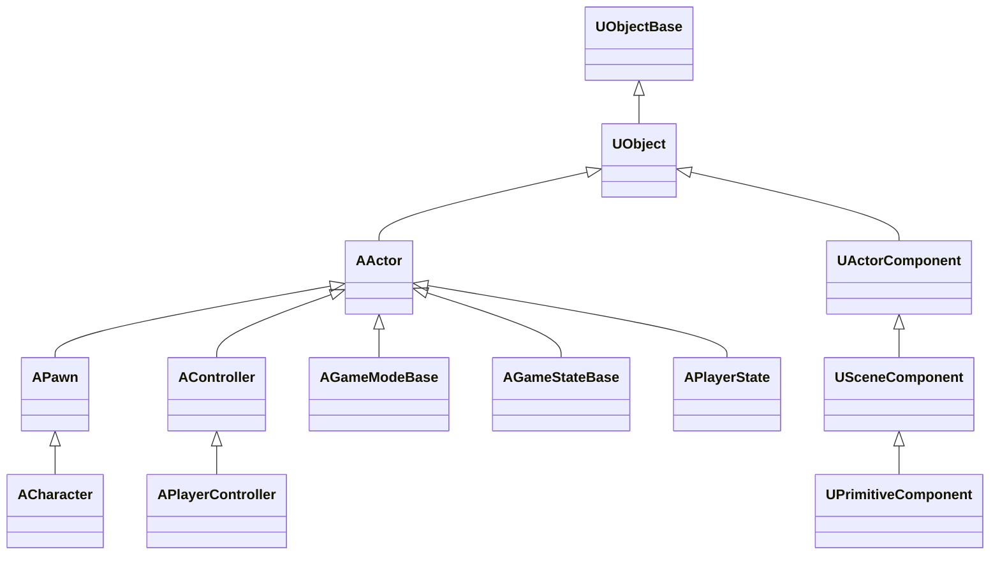
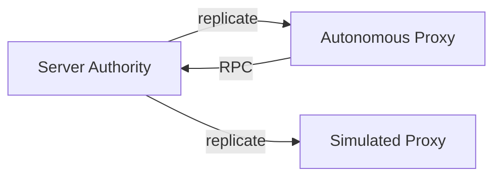
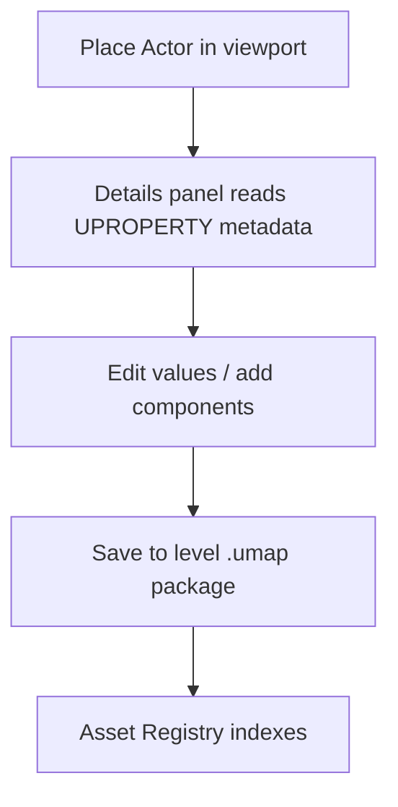
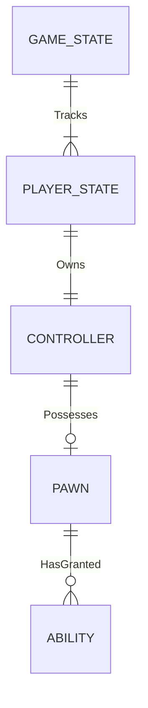

# 02 — Object Model vs ECS

## What UE5 Provides

UE5's gameplay foundation is a **reflection-driven object hierarchy** rooted in `UObject`, composed into world objects via `AActor` + `UActorComponent`.

### Class Hierarchy (conceptual)



**Local references:**
- `Engine/Source/Runtime/CoreUObject/Public/UObject/Object.h`
- `Engine/Source/Runtime/Engine/Classes/GameFramework/Actor.h`
- `Engine/Source/Runtime/Engine/Classes/Components/ActorComponent.h`
- `Engine/Source/Runtime/Engine/Classes/GameFramework/Pawn.h`
- `Engine/Source/Runtime/Engine/Classes/GameFramework/Character.h`
- `Engine/Source/Runtime/Engine/Classes/GameFramework/Controller.h`
- `Engine/Source/Runtime/Engine/Classes/GameFramework/GameModeBase.h`

### UObject

| Responsibility | Detail |
|----------------|--------|
| Type identity | Every instance has a `UClass` |
| Reflection | Properties exposed to editor, Blueprint, serialization |
| Serialization | `UPROPERTY` drives save/load and network replication |
| GC | Mark-and-sweep garbage collection via object graph |
| Packages | Objects live in `.uasset` packages with outer chain |
| Networking | `NetGUID`, replication lifetime |

### AActor

| Responsibility | Detail |
|----------------|--------|
| World presence | Placed in `ULevel` / `UWorld` |
| Component container | Owns `TArray<UActorComponent*>` |
| Lifecycle | Spawn → RegisterComponents → BeginPlay → Tick → EndPlay → Destroy |
| Transform root | Via root `USceneComponent` |
| Replication | `GetLifetimeReplicatedProps`, role (Authority/Autonomous/Simulated) |
| Tick | `PrimaryActorTick`, can disable per-actor |

### UActorComponent

| Responsibility | Detail |
|----------------|--------|
| Modular capability | Movement, mesh, audio, ASC, etc. |
| Registration | `RegisterComponent()` hooks world subsystems |
| Tick | Independent tick optional |
| Replication | Component-level `UPROPERTY(Replicated)` |

### Gameplay Framework Types

| Type | Role | Typical lifetime |
|------|------|------------------|
| **APawn** | Possessable physical agent | Per spawn |
| **ACharacter** | Pawn + `CharacterMovementComponent` + skeletal mesh | Per spawn |
| **AController** | Brain that possesses a Pawn | May survive pawn death |
| **APlayerController** | Controller + input + HUD + camera | Per player connection |
| **AGameModeBase** | Server-only rules (spawn, scoring) | Match |
| **AGameStateBase** | Replicated match state | Match |
| **APlayerState** | Per-player replicated stats, often hosts GAS ASC | Per player |

### Reflection / Property System

Powered by **UnrealHeaderTool (UHT)** code generation:

| Macro | Purpose |
|-------|---------|
| `UCLASS` | Register type, Blueprint exposure |
| `UPROPERTY` | Serialize, replicate, edit, save |
| `UFUNCTION` | Blueprint callable, RPC |
| `USTRUCT` | Value types with reflection |

Editor **Details panel** and **Blueprint** consume reflected metadata.

### Serialization / Save-Load

| Mechanism | Use |
|-----------|-----|
| `UPROPERTY(SaveGame)` | Checkpoint saves |
| Package serialization | Asset persistence (.uasset) |
| `FArchive` | Binary/text serialization pipeline |
| Versioning | `CustomVersion` per struct/package |

---

## Why It Exists

| Design | Motivation |
|--------|------------|
| **UObject + reflection** | Single metadata source for editor, Blueprint, network, save |
| **Actor/Component** | Designer-friendly composition without deep inheritance |
| **GC** | Simplifies UObject graph; avoids Rust-style ownership complexity in C++ |
| **Pawn/Controller split** | Possession model: swap body without swapping brain |
| **GameMode/State/PlayerState** | Server-authoritative rules vs replicated match/player data |
| **Package outer chain** | Asset referencing, subobject nesting, editor asset identity |

---

## Core Data Structures (conceptual)

### UObject identity

```
UObject
├── Class: UClass*
├── Outer: UObject* (ownership chain)
├── Package: UPackage*
├── Name: FName
├── ObjectFlags
└── Properties (reflected layout)
```

### Actor composition

```
AActor
├── RootComponent: USceneComponent*
├── InstanceComponents[]
├── BlueprintCreatedComponents[]
├── ReplicatedMovement (optional)
├── Role / RemoteRole (network)
└── PrimaryActorTick
```

### Replication property descriptor

```
DOREPLIFETIME / Registered subobjects
→ FProperty replication layout
→ Per-connection dirty tracking
→ Push model (UE5) or traditional
```

---

## Runtime Flow

### Spawn sequence

```mermaid
sequenceDiagram
    participant GM as GameMode
    participant World
    participant Actor
    participant Comp as Components

    GM->>World: SpawnActor<T>()
    World->>Actor: Construct (C++ / BP)
    Actor->>Comp: CreateDefaultSubobjects
    Actor->>Comp: RegisterComponent (each)
    Comp->>World: Hook physics/render/ASC
    Note over Actor: Deferred spawn optional
    World->>Actor: BeginPlay
    Comp->>Comp: BeginPlay (ordered)
```

### Tick order (simplified)

1. `TG_PrePhysics` — input, movement intent
2. `TG_DuringPhysics` — physics simulation
3. `TG_PostPhysics` — attach, follow physics
4. `TG_PostUpdateWork` — camera, late animation
5. `TG_LastDemotable` — cleanup

### Network role flow



---

## Editor / Tooling Flow



- **Blueprint**: subclass `AActor`, add components, wire events visually
- **Component visualizers**: editor-only debug draw per component type
- **Data validation**: editor commandlets check asset rules

---

## What Bevy Already Has

| UE5 concept | Bevy equivalent |
|-------------|-----------------|
| `UObject` identity | `Entity` (opaque ID) |
| `AActor` | Entity + component bundle (e.g. `Transform`, markers) |
| `UActorComponent` | Individual components |
| `USceneComponent` hierarchy | `Parent` / `Children` + `Transform` propagation |
| `UPrimitiveComponent` | `Mesh3d`, `Collider`, visibility components |
| Reflection | `bevy_reflect` — partial; no editor metadata pipeline |
| Serialization | `serde` + custom `Scene` format; no unified property system |
| GC | Entity despawn; Rust ownership — no GC |
| `APawn` / `ACharacter` | Convention via marker components |
| GameMode etc. | Not built-in; app-defined resources/entities |
| Replication | Not in core; ecosystem crates |

**Bevy 0.16 additions relevant here:**
- **ECS Relationships** — bidirectional entity links (closer to UE subobject outers)
- **Improved spawn API** — hierarchical spawning
- **Entity cloning** — prefab duplication

---

## Architectural Comparison

| Aspect | UE5 Actor-Component | Bevy ECS |
|--------|---------------------|----------|
| **Memory layout** | AoS per object; cache misses on iteration | SoA archetypes; fast batch systems |
| **Composition** | Add component at runtime (typed pointer) | Add component at runtime (type ID) |
| **Type query** | `GetComponent<T>()` | `Query<(&A, &B)>` |
| **Identity** | `AActor*` stable pointer | `Entity` may be recycled |
| **Inheritance** | Class hierarchy (BP subclass) | No inheritance; marker + components |
| **Editor binding** | Reflection metadata | Manual or `bevy_reflect` + custom UI |
| **Networking** | Property replication built-in | Must design per-component sync |

### Anti-pattern for Bevy stack

❌ **Do not** create `struct Actor { components: Vec<Box<dyn Component>> }` — you lose ECS benefits.

✅ **Do** use marker components + typed systems:

```rust
// Conceptual — not a stable API
#[derive(Component)]
struct Pawn;

#[derive(Component)]
struct PlayerOwned { player_id: u32 }

#[derive(Component)]
struct AbilityUser; // links to ability registry entity
```

---

## What We Need to Build

| Component | Purpose |
|-----------|---------|
| `aa_scene::Prefab` | Spawn blueprint equivalent (entity hierarchy + components) |
| `aa_reflect` | Type registry, property metadata, editor binding |
| `aa_gameplay::GameMode` | Server rules resource + systems |
| `aa_gameplay::PlayerState` | Per-player entity archetype |
| `aa_gameplay::Possession` | Controller ↔ Pawn relationship (use ECS Relationships) |
| `aa_save` | Save-game component filtering + versioning |
| `aa_net::Replicated` | Derive macro marking sync fields |

---

## Minimum Viable Version (MVP)

| Feature | Implementation |
|---------|----------------|
| Pawn spawn | `Pawn` marker + `Transform` + physics bundle |
| Controller | `Controller` component + `Possesses(Entity)` relationship |
| Player | `PlayerController` + input mapping |
| GameMode | `GameMode` resource on server; spawn system |
| Prefabs | RON scene files loaded via `bevy_scene` |
| Save | Serialize entities with `Saveable` marker + `serde` |

**Checklist:**
- [ ] `Possesses` / `ControlledBy` relationship pair
- [ ] `PlayerState` entity spawned per connection
- [ ] `GameState` resource (replicated manually)
- [ ] Prefab spawn API `aa_scene::spawn_prefab("player")`
- [ ] No GC — explicit `despawn` on death with cleanup systems

---

## AA-Quality Version

| Feature | Implementation |
|---------|----------------|
| Full reflection | `aa_reflect` with editor widgets per property |
| Replication mapping | Auto-sync `Replicated` components |
| Subobject-like nesting | Child entities with lifecycle binding |
| Blueprint alternative | Hot-reloadable WASM script components OR Rust fn pointers |
| Asset references | `Handle<T>` with soft/strong refs (PrimaryAssetId pattern) |
| Type-safe RPC | `aa_net` command/event channels per component |

---

## Risks and Hard Parts

| Risk | Notes |
|------|-------|
| **No unified property graph** | Every editor field needs manual or derived UI |
| **Entity recycling** | Stale entity references if not using `Entity` validity checks |
| **Replication without reflection** | Must hand-write or derive sync for each component |
| **Possession edge cases** | Pawn death, seamless travel, spectator — relationship cleanup |
| **Save game scope** | World + streaming + dynamic entities = complex snapshot |

---

## Suggested Rust Crate / Module Boundaries

```
aa_reflect/
├── registry/      # TypeId → PropertyInfo
├── derive/        # #[derive(Reflect, Replicated)]
└── serde_bridge/  # Save/load from reflection

aa_scene/
├── prefab/        # Prefab asset + spawn
├── hierarchy/     # Parent/Children helpers
└── lifecycle/     # OnSpawn, OnDespawn events

aa_gameplay/
├── pawn/          # Pawn, Character bundles
├── controller/    # Controller, PlayerController
├── possession/    # Possession relationships
├── game_mode/     # GameMode, GameState resources
└── player_state/  # PlayerState entity template

aa_save/
├── snapshot/      # World snapshot format
└── versioning/    # Migration between save versions
```

### Entity Archetype Templates (proposed)

| UE5 type | Bevy archetype |
|----------|----------------|
| `ACharacter` | `Pawn + CharacterMovement + Mesh + Collider + AbilityUser` |
| `APlayerController` | `Controller + PlayerInput + CameraTarget` |
| `APlayerState` | `PlayerState + PlayerId + Team + AbilityUser` |
| `AGameState` | Resource `GameState` (not entity) or singleton entity |
| `AGameMode` | Resource `GameMode` (server only) |

### Relationship Model (Bevy 0.16+)



Use `#[relationship]` components for `Possesses` ↔ `PossessedBy` pairs (Bevy native feature).

---

## Key Takeaway

UE5's Actor model is a **composition + reflection + GC** triad optimized for editor and Blueprint workflows. Bevy's ECS is **data-oriented + explicit lifetimes**. The AA stack should:

1. Map **responsibilities**, not class names
2. Use **relationships** for possession and ownership
3. Build **reflection separately** for editor/save/net — do not recreate `UObject`
4. Treat GameMode/State/PlayerState as **well-defined archetypes**, not OOP hierarchy

---

*Local citations: `CoreUObject/Public/UObject/Object.h`, `Engine/Classes/GameFramework/Actor.h`, `Pawn.h`, `Character.h`, `GameModeBase.h`*
