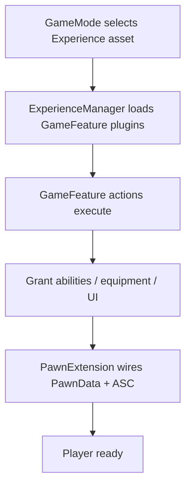
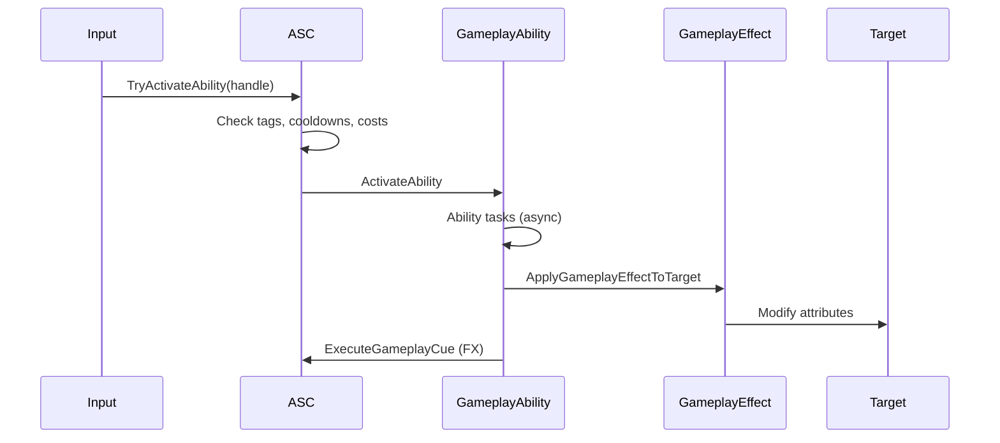
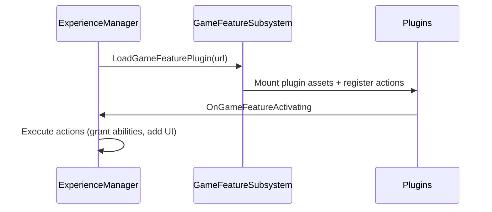

# 03 — Gameplay Framework

## What UE5 Provides

UE5's gameplay layer combines **Gameplay Ability System (GAS)**, **Gameplay Tags**, **Enhanced Input**, **Modular Gameplay / Game Features**, and sample patterns from **Lyra**.

### Gameplay Ability System (GAS)

**Primary docs:** `Engine/Plugins/Runtime/GameplayAbilities/README.md`  
**Official:** [Gameplay Ability System documentation](https://dev.epicgames.com/documentation/en-us/unreal-engine/gameplay-ability-system-for-unreal-engine)

| Concept | Role |
|---------|------|
| **AbilitySystemComponent (ASC)** | Gateway for abilities, effects, attributes, prediction |
| **GameplayAbility** | Instanced action logic (dash, attack, interact) |
| **GameplayEffect** | Data-driven buff/debuff/damage rules |
| **AttributeSet** | Float attributes with Base + Current values |
| **Gameplay Tags** | Hierarchical state labels + query language |
| **Gameplay Cues** | Decoupled VFX/SFX triggered by tags |
| **Gameplay Ability Tasks** | Async/latent steps within abilities |
| **Ability Spec** | Runtime grant config (level, input binding) |

**ASC placement rule (from README):**
- **Players:** ASC on `PlayerState` (survives pawn death)
- **AI bots:** ASC on `Pawn`

**Damage at Epic:** `AActor::TakeDamage` deprecated internally; damage flows through GAS GameplayEffects.

### Gameplay Tags

Module: `Engine/Source/Runtime/GameplayTags/`

| Feature | Purpose |
|---------|---------|
| Hierarchical tags | `State.Debuff.Stunned`, `Ability.Cooldown.Fireball` |
| Tag queries | `MatchesTag`, `HasAll`, `HasAny` for conditions |
| Replication | Tag container sync on ASC |
| Editor | Tag dictionary asset, gameplay tag editor |

### Enhanced Input

Plugin: `Engine/Plugins/EnhancedInput/`

| Concept | Role |
|---------|------|
| **Input Action** | Semantic action (Jump, Fire) |
| **Input Mapping Context** | Bind keys/gamepad → actions per context |
| **Modifiers** | Negate, scale, smooth |
| **Triggers** | Pressed, released, hold, chorded |
| **Priority** | Stack mapping contexts (UI vs gameplay) |

Replaces legacy `Axis/Action` mappings in `DefaultInput.ini`.

### State Machines

| System | Use |
|--------|-----|
| **Animation State Machine** | AnimBP states (see ch.06) |
| **Gameplay Ability states** | Tags + ability blocking tags |
| **UI state** | CommonUI + widget stacks (Lyra) |
| **Modular gameplay init** | `IGameFrameworkInitStateInterface` (Lyra) |

No single UE "gameplay state machine" — behavior emerges from tags + abilities + anim states.

### Modular Gameplay & Game Features

| Module/Plugin | Role |
|---------------|------|
| `ModularGameplay` | Component-based game framework extension points |
| `ModularGameplayActors` | GameFramework actor variants for modular components |
| `GameFeatures` | Load/unload gameplay feature plugins at runtime |

**Lyra pattern** (`Samples/Games/Lyra/Source/LyraGame/`):

| Type | Path | Role |
|------|------|------|
| `ULyraExperienceDefinition` | `GameModes/LyraExperienceDefinition.h` | Data defining a match experience |
| `ULyraExperienceManagerComponent` | `GameModes/LyraExperienceManagerComponent.h` | Loads experience + game features |
| `ULyraPawnExtensionComponent` | `Character/LyraPawnExtensionComponent.h` | Pawn init state machine |
| Game Feature Plugins | `Samples/Games/Lyra/Plugins/GameFeatures/` | ShooterCore, TopDownArena, etc. |

**Experience boot flow:**



### Lyra Module Domains

From `Samples/Games/Lyra/Source/LyraGame/`:

`AbilitySystem`, `Animation`, `Audio`, `Camera`, `Character`, `Equipment`, `GameFeatures`, `GameModes`, `Input`, `Interaction`, `Inventory`, `Player`, `System`, `Teams`, `UI`, `Weapons`

**Lyra dependencies** (`LyraGame.Build.cs`): GAS, GameFeatures, ModularGameplay, EnhancedInput, ReplicationGraph, Iris, CommonUI.

---

## Why It Exists

| System | Motivation |
|--------|------------|
| **GAS** | Unified damage/buff/cooldown/prediction; designer-tunable effects |
| **Gameplay Tags** | Composable state without bool explosion |
| **Enhanced Input** | Context-sensitive rebinding; semantic actions |
| **Game Features** | Ship modes/weapons as loadable plugins; live ops |
| **Experience definitions** | Data-driven match setup without code forks |
| **Init state machine** | Order-dependent pawn setup (ASC before input before mesh) |

---

## Core Data Structures (conceptual)

### GAS

```
AbilitySystemComponent
├── GrantedAbilitySpecs[]
├── ActiveGameplayEffects[]
├── AttributeSets[]
├── OwnedGameplayTags
└── Prediction interface

GameplayAbilitySpec
├── AbilityClass
├── Level
├── InputID (optional)
└── Handle (stable reference)

GameplayEffectSpec
├── Effect definition
├── Duration / magnitude modifiers
├── Source ASC / target ASC
└── Aggregated attribute modifiers
```

### Tag query

```
FGameplayTagQuery
├── Expr: All / Any / None
└── Tags: hierarchical match
```

### Experience (Lyra)

```
LyraExperienceDefinition
├── GameFeaturePluginURLs[]
├── DefaultPawnData
├── ActionSets[]
└── UI layout config
```

---

## Runtime Flow

### Ability activation



### Attribute modification

All changes should flow through GameplayEffects (not direct writes) for prediction rollback.

**Aggregation:** Multiple `Multiply` modifiers add before apply (10% + 30% = 40%, not 1.1×1.3).

### Game Feature load



---

## Editor / Tooling Flow

| Tool | Purpose |
|------|---------|
| GAS editor widgets | Attribute picker in GameplayEffect assets |
| Gameplay Tag editor | `ProjectSettings → Gameplay Tags` |
| Enhanced Input | Input Action / Mapping Context assets |
| Game Feature Data | `GameFeatureData` asset per plugin |
| Lyra Experience | Data asset in Content (not in git sample) |

---

## What Bevy Already Has

| UE5 | Bevy / ecosystem |
|-----|-----------------|
| GAS | **None** — build from scratch |
| Gameplay Tags | **None** — `bitflags` or custom crate |
| Enhanced Input | `bevy_input` — low-level; no mapping contexts |
| Game Features | Dynamic `Plugin` loading possible but no standard |
| Cooldowns/effects | App-defined components |
| Prediction | `lightyear` prediction patterns (ecosystem) |
| Init states | Manual system ordering / state machine crate |

---

## What We Need to Build

| Crate | Responsibility |
|-------|----------------|
| `aa_ability` | ASC equivalent, abilities, effects, prediction hooks |
| `aa_tags` | Hierarchical tags + query DSL |
| `aa_input` | Mapping contexts, actions, modifiers |
| `aa_features` | Runtime plugin load + action execution |
| `aa_experience` | Experience definition assets |

---

## Proposed Bevy Equivalent

### Ability System Component (ECS-native)

**Do not** make a monolithic `AbilitySystemComponent` struct. Split:

| Component | Data |
|-----------|------|
| `AbilityRegistry` | Granted specs, handles |
| `ActiveEffects` | Ongoing effect instances |
| `AttributeSet` | Typed attribute blocks (Health, Stamina, …) |
| `GameplayTags` | `TagContainer` component |
| `AbilityPrediction` | Rollback snapshot (client only) |

Attach to **PlayerState entity** (players) or **Pawn entity** (AI).

### Ability as trait + asset

```rust
// Conceptual architecture
trait GameplayAbility: Send + Sync {
    fn can_activate(&self, ctx: &AbilityContext) -> bool;
    fn activate(&self, ctx: &mut AbilityContext) -> AbilityTaskStream;
    fn end(&self, ctx: &mut AbilityContext, reason: EndReason);
}
```

- **MVP:** Rust impls registered in ability registry
- **AA:** RON/WASM ability definitions with scripted tasks

### GameplayEffect

Data asset:

```ron
# conceptual
(
    duration: Infinite,
    modifiers: [
        (attribute: "Health", op: Add, magnitude: -10.0),
    ],
    granted_tags: ["State.Debuff.Burning"],
    cues: ["GameplayCue.Fire"],
)
```

### Tags crate

```rust
// Hierarchical: "Ability.Cooldown.Fireball" 
// Stored as interned string or compact trie
struct TagContainer(BitSet or HashSet<TagId>);
fn query(container: &TagContainer, q: &TagQuery) -> bool;
```

### Enhanced Input equivalent

```rust
struct InputMappingContext {
    mappings: Vec<(InputAction, Vec<Binding>)>,
    priority: i32,
}
// System: push/pop contexts on UI open, vehicle enter, etc.
```

### Experience / Game Features

```rust
struct ExperienceDefinition {
    features: Vec<FeaturePluginId>,
    pawn_data: Handle<PawnData>,
    startup_systems: Vec<SystemId>,
}
// On match start: load feature plugins, run action queue
```

---

## Minimum Viable Version (MVP)

| Feature | Scope |
|---------|-------|
| Tags | 64–256 fixed tags or string interner |
| Attributes | Health, Energy; Base + Current |
| Effects | Instant + duration; Add/Multiply modifiers |
| Abilities | 3–5 hardcoded Rust abilities (jump, fire, reload) |
| Input | 1 mapping context; keyboard + gamepad |
| Cooldowns | Simple `Cooldown` component per ability |
| No prediction | Server authoritative only |

**Checklist:**
- [ ] `aa_tags` with `HasAll`/`HasAny` queries
- [ ] `AbilityRegistry` on player entity
- [ ] `TryActivateAbility` system
- [ ] `GameplayEffectApply` system
- [ ] Input → ability activation bridge
- [ ] Tag-based blocking (`State.Stunned` blocks move)

---

## AA-Quality Version

| Feature | Scope |
|---------|-------|
| Full GAS parity subset | Cues, tasks, target data, costs |
| Client prediction | Rollback on mispredict (integrate `aa_net`) |
| Game Features | Hot-load feature crates at match start |
| Experiences | Data-driven mode selection |
| Designer effects | RON/TOML effect assets + hot reload |
| Attribute capture | Kill credit / damage instigator chain |
| Team filters | Targeting by team ID + tag queries |

---

## Risks and Hard Parts

| Risk | Severity |
|------|----------|
| Prediction + rollback | **Critical** — GAS complexity is largely here |
| Effect aggregation edge cases | High — order, clamping, immunity tags |
| Monolithic ASC temptation | Medium — keep ECS splits or lose parallelism |
| Game Feature DLL safety | High — Rust dynamic loading is immature; prefer compile-time features initially |
| Designer workflow without BP | High — need data assets + editor or AI authoring |

---

## Suggested Rust Crate / Module Boundaries

```
aa_tags/
├── tag.rs           # TagId, hierarchy
├── container.rs     # TagContainer
└── query.rs         # TagQuery DSL

aa_ability/
├── asc/             # AbilityRegistry, ActiveEffects (split components)
├── ability/         # GameplayAbility trait, specs, handles
├── effect/          # GameplayEffect assets, application, aggregation
├── attribute/       # AttributeSet, modifiers
├── cue/             # GameplayCue events → VFX/audio systems
├── task/            # Async ability tasks (coroutines / events)
└── prediction/      # Client prediction snapshots

aa_input/
├── action.rs        # InputAction definitions
├── context.rs       # Mapping contexts, stack
├── binding.rs       # Keys, gamepad, modifiers
└── system.rs        # Input → action resolution

aa_features/
├── loader.rs        # Game feature plugin mount
├── action.rs        # Feature actions (grant ability, add UI)
└── lifecycle.rs     # Activate/deactivate hooks

aa_experience/
├── definition.rs    # Experience asset
└── manager.rs       # Boot sequence systems
```

### System ordering (Bevy)

```
PreUpdate:
  input_context_system
  ability_input_buffer_system
FixedUpdate:
  ability_cooldown_tick
  effect_duration_tick
Update:
  ability_activation_system
  effect_application_system
  gameplay_cue_spawn_system
PostUpdate:
  tag_cleanup_system
```

---

## Lyra Lessons for Bevy Stack

| Lyra lesson | Bevy action |
|-------------|-------------|
| ASC on PlayerState | Attach ability components to player-state entity |
| Experience-driven boot | `ExperienceDefinition` asset + loader system |
| Game Features as plugins | Cargo feature crates per mode; runtime load later |
| Init state machine | `InitState` component progression (Spawning → DataReady → Ready) |
| Team-based targeting | `TeamId` component + filter in ability targeting |
| Iris for replication | Use `aa_net` component sync for attributes/tags |

---

*Local citations: `Engine/Plugins/Runtime/GameplayAbilities/README.md`, `Samples/Games/Lyra/Source/LyraGame/`, `Engine/Plugins/EnhancedInput/`, `LyraGame.Build.cs`*
