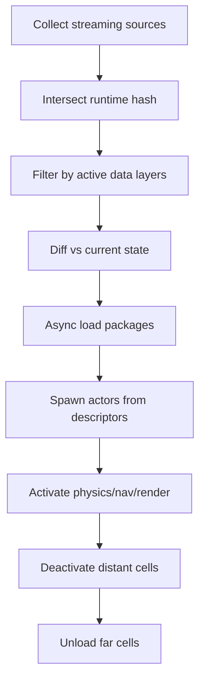
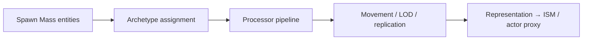
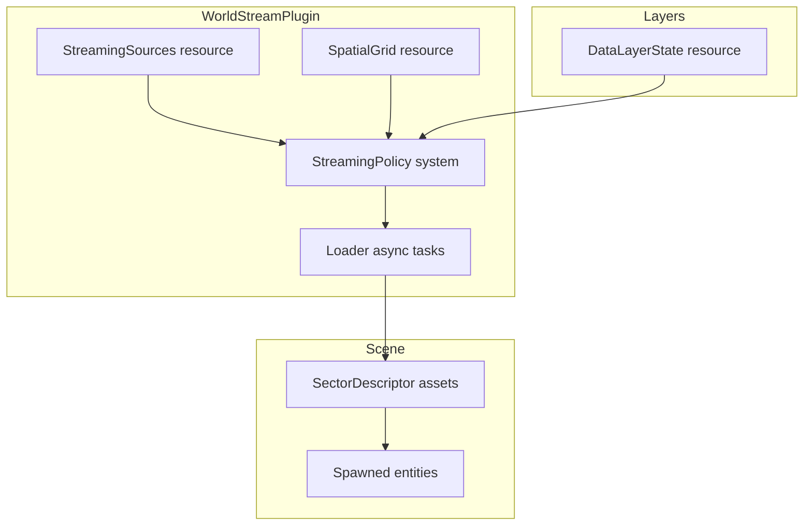

# 04 — World Streaming

## What UE5 Provides

UE5 open-world scale is addressed by **World Partition**, **level streaming**, **data layers**, **spawn systems**, **navigation**, and **Mass Entity** for crowds.

### World Partition

**Central type:** `UWorldPartition`  
**Path:** `Engine/Source/Runtime/Engine/Public/WorldPartition/WorldPartition.h`

| Component | Role | Path |
|-----------|------|------|
| **Actor descriptors** | Spatial metadata without full actor load | `WorldPartitionActorDesc.h` |
| **Runtime hash / cells** | Spatial grid of loadable regions | `WorldPartitionRuntimeHash.h`, `WorldPartitionRuntimeCell.h` |
| **Streaming policy** | Computes load/activate/deactivate/unload sets | `WorldPartitionStreamingPolicy.h` |
| **Streaming sources** | Camera/pawn-driven spheres (location, radius, priority) | `WorldPartitionStreamingSource.h` |
| **HLOD** | Hierarchical LOD layers for distant cells | `WorldPartitionHLOD/` |
| **Data layers** | Logical visibility/load filters | `DataLayer/DataLayerManager.h` |

### Streaming State Machine

From `WorldPartitionStreamingPolicy.h`:

```
Cell states: Unloaded → Loaded → Activated → Deactivated → Unloaded
```

Policy evaluates each frame (or throttled):
- **ToLoad** — fetch package data
- **ToActivate** — spawn actors into world
- **ToDeactivate** — hide/sim-stop without unload
- **ToUnload** — release memory

### Data Layers

| Type | Role |
|------|------|
| `UDataLayerAsset` | Authoring identity |
| `UDataLayerInstance` | Runtime state: Unloaded / Loaded / Activated |
| `UDataLayerManager` | API (replaces deprecated `UDataLayerSubsystem` UE 5.3+) |
| `AWorldDataLayers` | World actor hosting layer state |

Server-authoritative layer state replicates to clients (per `DataLayerManager.h`).

**Use cases:** Lighting scenarios, destroyed buildings, seasonal variants, MP game phases.

### Classic Level Streaming

Pre-World-Partition: sub-level `.umap` streaming volumes. Still supported; WP supersedes for large worlds.

| Concept | Role |
|---------|------|
| `ULevelStreaming` | Load/unload level by name |
| Streaming volume | Trigger via overlap |
| Layered loading | Priority + async package load |

### Spawn Systems

| System | Role |
|--------|------|
| `AActor::SpawnActor` | Standard spawn |
| World Partition cell activation | Batch spawn from actor descriptors |
| `ALevelInstance` | Embedded sub-worlds |
| PCG | Procedural placement (plugin) |

### Navigation

Module: `Engine/Source/Runtime/NavigationSystem/`

| Component | Role |
|-----------|------|
| `UNavigationSystemV1` | Navmesh management |
| `RecastNavMesh` | Tile-based navmesh |
| `NavMeshBoundsVolume` | Generation bounds |
| Runtime regeneration | Dynamic obstacles, slice updates |

World Partition integrates navmesh tiles per cell (unknown / needs deeper source inspection for tile boundary details).

### Mass Entity (Crowds)

**Core moved to engine:** `Engine/Source/Runtime/MassEntity/`  
Deprecated plugin shell: `Engine/Plugins/Runtime/MassEntity/MassEntity.uplugin`

| Type | Role |
|------|------|
| `FMassEntityManager` | Archetypes, fragments, commands |
| `UMassEntitySubsystem` | Per-world manager |
| `UMassProcessor` | Query + batch processing |
| `FMassRuntimePipeline` | Ordered processor graph |

**MassGameplay plugin:** `Engine/Plugins/Runtime/MassGameplay/`  
Submodules: MassActors, MassReplication, MassSimulation, MassSmartObjects, MassSignals

### City Sample

**Not in local tree.** External Marketplace project demonstrating WP + Mass crowds at city scale. Lessons (from Epic public talks/docs, not local source):

- Combine WP streaming with Mass for background crowds
- Use data layers for time-of-day / event states
- Custom HLOD for distant city blocks

---

## Why It Exists

| System | Motivation |
|--------|------------|
| **World Partition** | Single large world map without manual sub-level management |
| **Actor descriptors** | Load only metadata until cell activation |
| **Data layers** | Toggle world regions without duplicate maps |
| **Streaming sources** | Multi-player / multi-camera relevancy |
| **Mass Entity** | Thousands of agents without Actor overhead |
| **HLOD** | Distant cells as merged proxies |

---

## Core Data Structures (conceptual)

### World Partition cell

```
WorldPartitionRuntimeCell
├── Bounds (3D)
├── DataLayers[] (filter)
├── ActorDescriptors[] (lightweight)
├── LoadingState: Unloaded | Loaded | Activated
└── HLOD parent link (optional)
```

### Streaming source

```
FWorldPartitionStreamingSource
├── Location, Rotation
├── Radius, Cone angle
├── Priority
└── Target state (loaded vs activated)
```

### Mass fragment model

```
Entity = archetype(FragmentA, FragmentB, ...)
Fragment = POD component in Mass (not UObject)
Processor = query matching archetypes → batch mutate
```

---

## Runtime Flow

### World Partition tick



### Mass processing



**Representation:** Mass entities often render as instanced meshes; hero agents promote to full actors.

---

## Editor / Tooling Flow

| Tool | Path |
|------|------|
| World Partition editor | `Engine/Source/Editor/WorldPartitionEditor/` |
| Data Layer outliner | WP editor panels |
| HLOD builder | WP HLOD generation tools |
| One File Per Actor | WP conversion from traditional levels |
| Mass entity debugger | unknown / needs source inspection |

---

## What Bevy Already Has

| UE5 | Bevy |
|-----|------|
| World Partition | **None** |
| Level streaming | **None** (manual scene loading) |
| Data layers | **None** |
| Mass Entity | **None** (pure ECS is similar but no representation pipeline) |
| Navmesh | Ecosystem (`bevy_rerecast`, `landmass` experiments) |
| Large scenes | Standard ECS handles many entities; no spatial load system |
| HLOD | LOD via mesh settings; no automated merge pipeline |

Bevy strengths: fast iteration, ECS batch processing. Gap: **spatially-aware asset lifecycle**.

---

## What We Need to Build

| System | Crate |
|--------|-------|
| Sector grid + streaming | `aa_world_stream` |
| Data layers | `aa_world_stream::layers` |
| Actor descriptors | `aa_world_stream::desc` |
| Async asset load gates | `aa_assets` integration |
| Crowd simulation | `aa_crowd` |
| Navmesh tiles | `aa_nav` |

---

## Proposed Bevy World Streaming Architecture



### Sector descriptor (lightweight)

```ron
# conceptual sector descriptor
SectorDescriptor(
    id: "cell_12_8",
    bounds: Aabb(...),
    layers: ["Base", "NightLights"],
    entities: [
        (prefab: "building_a", transform: ...),
        (prefab: "npc_spawner", transform: ...),
    ],
)
```

### Streaming source component

```rust
#[derive(Component)]
struct StreamingSource {
    radius: f32,
    priority: i8,
    target_activation: bool,
}
// On Camera, PlayerPawn, split-screen players
```

### Data layer

```rust
#[derive(Resource)]
struct DataLayerManager {
    layers: HashMap<LayerId, LayerState>, // Unloaded/Loaded/Active
}
// Entities tagged with `DataLayer("NightLights")` filtered at spawn
```

### Crowd layer (`aa_crowd`)

Separate **simulation world** or reserved entity ranges:

| Fragment | Data |
|----------|------|
| `MassPosition` | Vec3 |
| `MassVelocity` | Vec3 |
| `MassLOD` | u8 |
| `MassRepresentation` | ISM handle or actor promotion flag |

Processors run in `FixedUpdate` with SIMD-friendly batches.

---

## Minimum Viable Version (MVP)

| Feature | Scope |
|---------|-------|
| Fixed grid | 256m × 256m cells, 3×3 active window |
| Sync load | Block on sector RON load (no async) |
| Single layer | No data layer toggles |
| No HLOD | Full detail in active cells only |
| No Mass | Standard ECS for NPCs (<500) |
| Simple nav | `bevy_rerecast` single mesh |

**Checklist:**
- [ ] `SpatialGrid` resource from world bounds
- [ ] `StreamingSource` on player camera
- [ ] Load/unload sectors by grid diff
- [ ] Sector assets as `bevy_scene` or custom RON
- [ ] Despawn entities when sector unloads

---

## AA-Quality Version

| Feature | Scope |
|---------|-------|
| Async IO | `async_io` sector load with priority queue |
| Data layers | Replicated layer state for MP |
| HLOD sectors | Pre-baked impostor sectors |
| Multi-source | Split-screen + replay cameras |
| Mass crowds | 10k+ background agents with ISM rendering |
| Nav tiles | Per-sector navmesh stitch |
| WP editor | Sector painter in `aa_editor` |
| Streaming perf budget | Max loads/activations per frame |

---

## Risks and Hard Parts

| Risk | Notes |
|------|-------|
| **Async spawn + ECS** | Entity references across load boundaries |
| **Physics/nav stitch** | Seams at cell borders |
| **MP streaming desync** | Server must own layer state + spawn order |
| **Memory spikes** | Load budgeting critical |
| **HLOD bake pipeline** | Offline toolchain investment |
| **Mass ↔ Actor promotion** | State transfer at LOD transitions |

---

## Suggested Rust Crate / Module Boundaries

```
aa_world_stream/
├── grid.rs            # Spatial hash, cell coordinates
├── descriptor.rs      # SectorDescriptor asset
├── policy.rs          # Load/activate/deactivate diff
├── source.rs          # StreamingSource component
├── loader.rs          # Async sector load queue
├── layers.rs          # DataLayerManager
└── hlod.rs            # HLOD sector references (AA)

aa_crowd/
├── fragments.rs       # Mass-style POD components
├── processors/        # Movement, separation, LOD
├── representation.rs  # ISM batching, actor promotion
└── replication.rs     # Lightweight crowd sync

aa_nav/
├── recast/            # Navmesh build per sector
├── tiles.rs           # Tile stitching
└── query.rs           # Pathfinding API
```

### Schedule integration

```
PostUpdate (after camera):
  world_stream_policy_system
  world_stream_apply_system  # spawn/despawn
FixedUpdate:
  crowd_processors
  nav_agent_movement
```

---

## City Sample Lessons (external reference)

| Lesson | Bevy application |
|--------|------------------|
| WP + Mass split | `aa_world_stream` for geometry; `aa_crowd` for pedestrians |
| Time-of-day layers | Data layers for emissive/material variants |
| Traffic as specialized Mass | Custom processor pipeline for vehicles |
| Memory budgets | Strict per-frame activation caps |

---

## UE5 → Bevy Mapping

| UE5 | Proposed |
|-----|----------|
| `UWorldPartition` | `WorldStreamPlugin` + `SpatialGrid` |
| `WorldPartitionActorDesc` | `SectorEntityDescriptor` |
| `UDataLayerManager` | `DataLayerManager` resource |
| `ULevelStreaming` | `SectorLoader` (simpler fallback) |
| `FMassEntityManager` | `aa_crowd::CrowdWorld` |
| `UNavigationSystemV1` | `aa_nav::NavWorld` |

---

*Local citations: `Engine/Source/Runtime/Engine/Public/WorldPartition/`, `Engine/Source/Runtime/MassEntity/`, `Engine/Plugins/Runtime/MassGameplay/`*
