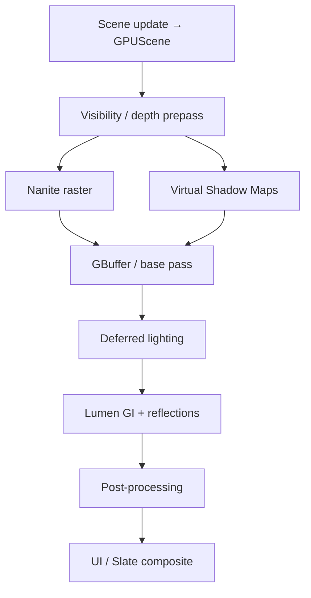

# 05 — Rendering Stack

## What UE5 Provides

UE5 rendering is a **monolithic deferred pipeline** inside the `Renderer` module, with flagship features **Nanite**, **Lumen**, and **Virtual Shadow Maps (VSM)** integrated into a shared frame graph.

### Module Topology

| Layer | Path | Role |
|-------|------|------|
| RHI | `Engine/Source/Runtime/RHI/` | GPU abstraction |
| RenderCore | `Engine/Source/Runtime/RenderCore/` | RDG, shaders, VT |
| Engine | `Engine/Source/Runtime/Engine/Public/Materials/` | Material assets, scene proxies |
| Renderer | `Engine/Source/Runtime/Renderer/` | Deferred shading, Nanite, Lumen, VSM, post |
| Shaders | `Engine/Shaders/Private/` | HLSL implementations |
| NaniteBuilder | `Engine/Source/Developer/NaniteBuilder/` | Offline mesh encoding |

### Nanite (conceptual)

**Not a separate runtime module** — lives in `Renderer/Private/Nanite/`.

| Aspect | Description |
|--------|-------------|
| Purpose | Virtualized micro-polygon geometry; auto LOD via cluster hierarchy |
| Build time | Mesh → cluster DAG encoding (`NaniteBuilder`) |
| Runtime | GPU culling + rasterization of visible clusters |
| Materials | Supports standard material graph per cluster |
| Limits | Primarily opaque static geometry; skeletal meshes use traditional path |

### Lumen (conceptual)

Path: `Engine/Source/Runtime/Renderer/Private/Lumen/`

| Aspect | Description |
|--------|-------------|
| Purpose | Dynamic global illumination + reflections |
| Technique | Surface cache, radiance cache, screen probes, software RT, HW RT |
| Inputs | Scene geometry, cards, distance fields |
| Scalability | Quality tiers via `Scalability.h` CVars |

### Virtual Shadow Maps

Path: `Engine/Source/Runtime/Renderer/Private/VirtualShadowMaps/`

| Aspect | Description |
|--------|-------------|
| Purpose | High-resolution shadows for many local lights + directional |
| Technique | Virtualized shadow depth pages (clipmap/array) |
| Integration | Fed into deferred lighting + Nanite raster |

### Materials

| Component | Role |
|-----------|------|
| Material graph | Node-based shader generation |
| Material instances | Parameter overrides without recompile |
| Domains | Surface, deferred decal, post-process, UI |
| Shader compilation | `ShaderCompileWorker` async; permutations cached |
| MaterialCache (UE5.4+) | `Engine/Source/Runtime/Engine/Internal/MaterialCache/` |

### Post-Processing

Path: `Engine/Source/Runtime/Renderer/Private/PostProcess/`

`AddPostProcessingPasses` orchestrates: TAA, bloom, DOF, motion blur, tonemap, eye adaptation, subsurface, etc.

### Scalability

| File | Role |
|------|------|
| `Engine/Source/Runtime/Engine/Public/Scalability.h` | Quality groups |
| `BaseScalability.ini` | Preset CVars |
| `BaseDeviceProfiles.ini` | Platform tiers |
| `GameUserSettings.cpp` | Runtime quality API |

Quality groups: resolution, view distance, anti-aliasing, shadows, GI, reflections, post-process, foliage, shading.

---

## Why It Exists

| Feature | Motivation |
|---------|------------|
| **Nanite** | Film-quality geo in real-time without manual LOD chains |
| **Lumen** | Dynamic GI without offline lightmaps |
| **VSM** | Shadow quality scales with contact detail |
| **Deferred pipeline** | Many lights + material complexity |
| **RDG** | Automatic pass scheduling + resource aliasing |
| **Scalability** | Ship same build on PC, console, mobile tiers |
| **Material permutations** | Artist-friendly graph → optimized GPU shaders |

---

## Core Concepts

### Frame graph (simplified)



### Scene representation

| Structure | Role |
|-----------|------|
| `FPrimitiveSceneProxy` | Render-thread representation of mesh |
| `GPUScene` | GPU-side primitive buffer |
| Material shader map | Compiled permutations per material |

### Nanite cluster hierarchy (conceptual)

```
Static mesh
└── Cluster tree (DAG)
    └── GPU selects LOD clusters per screen size
        └── Rasterize micropolygons directly
```

---

## Runtime Flow

1. **Game thread:** update transforms, register primitives
2. **Render thread:** build scene, enqueue RDG passes
3. **Nanite pass:** cluster cull + raster (async compute + graphics)
4. **Shadow pass:** VSM page allocation + depth render
5. **Lighting:** deferred + Lumen probes/cache update
6. **Post:** TAA → bloom → tonemap
7. **RHI:** submit to GPU

Scalability CVars gate passes (e.g. disable Lumen, reduce shadow pages).

---

## Editor / Tooling Flow

| Tool | Path |
|------|------|
| Material Editor | `Engine/Source/Editor/MaterialEditor/` |
| Static Mesh Editor | Nanite enable per mesh |
| Scalability toolbar | `Engine/Source/Editor/UnrealEd/` |
| Debug views | Lumen/Nanite/VSM viz menus in `CommonMenuExtensions` |
| Shader profiler | RenderDoc integration, `stat gpu` |

---

## What Bevy Can Do Now

From [Bevy 0.16 release](https://bevy.org/news/bevy-0-16/) and engine sources:

| Feature | Bevy status |
|---------|-------------|
| **PBR forward/deferred hybrid** | Core `bevy_pbr` |
| **Clustered forward** | Supported |
| **Virtual Geometry (Nanite-like)** | Experimental since 0.14; perf improvements in 0.16 |
| **GPU-driven rendering** | 0.16 — auto for standard 3D meshes + skinned |
| **Occlusion culling** | Experimental two-phase (0.16) |
| **Cascading shadow maps** | Supported |
| **TAA / MSAA** | TAA available |
| **Atmospheric scattering** | Procedural sky (0.16) |
| **Decals** | 0.16 |
| **Skinning** | GPU skinning |
| **Material system** | `StandardMaterial` + custom shaders via `Material` trait |
| **Lumen-equivalent GI** | **Not present** |
| **Virtual Shadow Maps** | **Not present** |
| **Nanite film geo** | VG experimental; not production-equivalent |
| **Node material editor** | **Not present** |

**MeshTag (0.16):** Per-instance `u32` for shader variation — useful for impostors/HLOD.

---

## What We Must Build or Integrate

| Capability | Approach | Priority |
|------------|----------|----------|
| **AA GI solution** | Integrate `[bevy_pathtracer]` experiments OR probe-based DDGI crate | P2 |
| **Virtual geometry production path** | Extend Bevy VG + offline cluster builder | P1 |
| **VSM or equivalent** | Research `[shadows]` crate or custom page table | P2 |
| **Material graph** | `aa_render::material_graph` + shader codegen via `naga` | P1 |
| **Scalability presets** | `aa_core::scalability` mirroring UE tiers | P0 |
| **Post-process stack** | Bloom, DOF, motion blur, color grading | P1 |
| **DDC for shaders** | Cache compiled `naga` permutations | P1 |
| **HLOD / impostor** | Offline bake + sector impostors (see ch.04) | P2 |

---

## Minimum Viable Version (MVP)

| Feature | Choice |
|---------|--------|
| Renderer | Stock `bevy_pbr` |
| Shadows | Single directional CSM |
| GI | Baked lightmaps OR simple SSAO only |
| Materials | `StandardMaterial` + 5 custom WGSL templates |
| LOD | Manual `MeshLod` components |
| Scalability | 3 presets: Low/Med/High resolution scale |
| Post | Tonemap + bloom |

**Checklist:**
- [ ] `ScalabilitySettings` resource applied at startup
- [ ] Quality preset switches shadow map size + MSAA
- [ ] Asset pipeline: glTF → Bevy mesh/material
- [ ] No custom Nanite/Lumen

---

## AA-Quality Version

| Feature | Target |
|---------|--------|
| Virtual geometry | Production path for static environment geo |
| GI | Probe grid or software RT GI pass |
| Shadows | High-res CSM + local light atlas OR VSM subset |
| Material editor | Node graph → WGSL codegen |
| Post stack | Full cinematic chain |
| Scalability | Per-group CVars like UE |
| GPU profiling | Tracy + render pass labels |
| Nanite-style builder | Offline `aa_mesh_builder` CLI |

---

## Risks and Hard Parts

| Risk | Severity |
|------|----------|
| **Lumen-class GI** | Very high — years of R&D at Epic |
| **Virtual geometry maturity** | High — Bevy VG still experimental |
| **Shader permutation explosion** | High — need aggressive caching |
| **wgpu feature parity** | Medium — bindless, mesh shaders vary by backend |
| **Art pipeline** | High — without material editor, artists blocked |

---

## Suggested Rust Crate / Module Boundaries

```
aa_render/
├── scalability/     # Quality tiers, CVars
├── post/            # Post-process plugin stack
├── material/
│   ├── graph/       # Node graph IR
│   ├── compile/     # naga codegen + cache
│   └── instance/    # Parameter overrides
├── virtual_geo/     # VG extensions, cluster loader
├── gi/              # DDGI / probe GI (AA)
├── shadows/         # CSM + future VSM
└── debug/           # Visualization passes

aa_mesh_builder/     # Offline Nanite-like cluster DAG (CLI)
```

### Integration with Bevy

```rust
// Conceptual plugin stack
app.add_plugins(DefaultPlugins)
   .add_plugins(AaRenderPlugin)
   .add_plugins(AaPostProcessPlugin)
   .add_plugins(AaScalabilityPlugin);
// Extend RenderApp labels for custom passes
```

### Render pass order (proposed)

```
NodeLabel::Prepass (optional)
→ ShadowPass
→ MainOpaque (VG + standard)
→ DeferredLighting OR ForwardCluster
→ GiPass (AA)
→ Transparent
→ PostProcess
→ Ui
```

---

## UE5 vs Bevy Feature Matrix

| Feature | UE5 | Bevy 0.16 | AA target |
|---------|-----|-----------|-----------|
| Micro-poly static geo | Nanite (production) | VG (experimental) | VG + builder |
| Dynamic GI | Lumen | None | Probe/DDGI |
| Virtual shadows | VSM | CSM | CSM → VSM |
| GPU-driven draws | Yes | Yes (0.16) | Extend |
| Material graph | Full editor | Code/WGSL | `aa_material` editor |
| Scalability | Mature | DIY | `aa_scalability` |
| SSS / hair | Advanced | Basic | Integrate crates |

---

## Integration Candidates (ecosystem)

| Crate | Use |
|-------|-----|
| `bevy_pbr` | Core rendering |
| `bevy_shader` / `naga` | Shader IR |
| `bevy_mod_atmosphere` | Atmosphere (compare to 0.16 built-in) |
| `bevy_hanabi` | Particles (Niagara alternative, see ch.09) |
| `bevy_solari` | Ray tracing experiments (unknown maturity) |

*Do not invent APIs — verify crate versions at integration time.*

---

*Local citations: `Engine/Source/Runtime/Renderer/`, `Engine/Source/Developer/NaniteBuilder/`, `Engine/Public/Scalability.h`, `Engine/Shaders/Private/Nanite/`, `Engine/Shaders/Private/Lumen/`*
