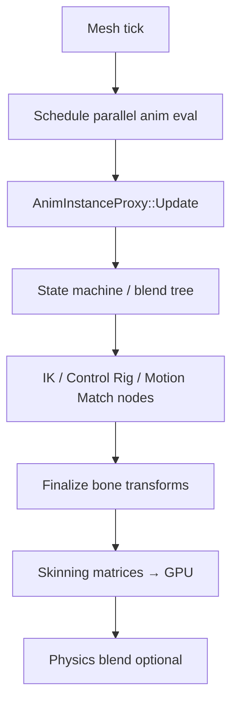
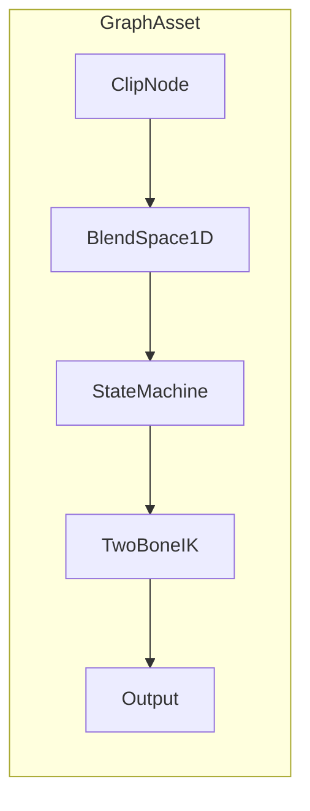

# 06 — Animation Stack

## What UE5 Provides

UE5 animation spans **skeletal playback**, **Animation Blueprints**, **blend spaces**, **Control Rig**, **IK**, **retargeting**, and **motion matching** — mostly pluginized beyond core Engine modules.

### Core Modules

| Module | Path | Role |
|--------|------|------|
| AnimationCore | `Engine/Source/Runtime/AnimationCore/` | IK solvers (TwoBone, CCD, FABRIK, spline) |
| Engine | `Engine/Source/Runtime/Engine/Private/Animation/` | Sequences, `AnimInstance`, montages |
| AnimGraphRuntime | `Engine/Source/Runtime/AnimGraphRuntime/` | Runtime anim nodes |
| AnimGraph | `Engine/Source/Editor/AnimGraph/` | Editor node definitions |
| SkeletalMeshComponent | `Engine/Classes/Components/SkeletalMeshComponent.h` | Skinning + eval hook |

### Animation Blueprints

| Piece | Role |
|-------|------|
| `UAnimInstance` | Per-mesh animation controller |
| `UAnimInstanceProxy` | Thread-safe eval on worker threads |
| Anim graph nodes | State machine, blend nodes, IK, Control Rig |
| `AnimationBlueprintEditor` | `Engine/Source/Editor/AnimationBlueprintEditor/` |
| Persona | Preview hub: `Engine/Source/Editor/Persona/` |

### Blend Spaces

1D/2D blend spaces interpolate animations by parameters (speed, direction). Assets authored in Persona; runtime nodes in `AnimGraphRuntime`.

### Control Rig

Plugin: `Engine/Plugins/Animation/ControlRig/`

| Module | Role |
|--------|------|
| ControlRig | Rig evaluation, hierarchy |
| ControlRigEditor | Authoring UI |
| RigVM dependency | `Engine/Plugins/Runtime/RigVM/` — VM for rig graphs |

Integrates with Sequencer for cinematic control.

### IK

| Source | Nodes |
|--------|-------|
| AnimationCore | TwoBoneIK, CCDIK, FABRIK, SplineIK |
| AnimGraphRuntime | `AnimNode_TwoBoneIK`, etc. |
| IKRig plugin | `Engine/Plugins/Animation/IKRig/` — foot placement, chains |
| FullBodyIK (experimental) | `Engine/Plugins/Experimental/FullBodyIK/` |

### Retargeting

| System | Path |
|--------|------|
| IK Retargeter (modern) | `Engine/Plugins/Animation/IKRig/.../Retargeter/` |
| Op stack | FK chains, pelvis motion, stride warping, floor constraint |
| Legacy | `SkeletonRemapping.cpp` in Engine |

### Motion Matching

Plugin: `Engine/Plugins/Animation/PoseSearch/`

| Component | Role |
|---------|------|
| Pose database | Pre-baked pose features |
| KD-tree / VP-tree | Fast pose search |
| `AnimNode_MotionMatching` | Runtime node |
| Trajectory features | Future root motion matching |
| Dependencies | AnimationWarping, BlendStack, Chooser |

Related: `AnimationLocomotionLibrary`, `MotionWarping` plugins.

### Compression

`ACLPlugin` — Animation Compression Library for smaller sequence data.

---

## Why It Exists

| System | Motivation |
|--------|------------|
| **AnimBP** | Designer-authored locomotion/combat graphs without C++ |
| **Blend spaces** | Smooth speed/direction transitions |
| **Control Rig** | Procedural animation + cinematic override |
| **IK** | Ground contact, aim offsets, ladder climb |
| **Retargeting** | Reuse animations across skeletons |
| **Motion matching** | High-quality locomotion without hand-tuned blend trees |
| **Parallel eval** | `AnimInstanceProxy` for performance |

---

## Core Data Structures (conceptual)

### Animation instance

```
USkeletalMeshComponent
├── AnimInstance (UAnimInstance)
│   └── AnimInstanceProxy
│       └── Node graph (compiled from AnimBP)
├── Bone transforms (local + component space)
├── Curve assets (float curves)
└── Montage slots
```

### Pose

```
FCompactPose
├── Bone indices + transforms
├── Curve values
└── Root motion delta (optional)
```

### Motion matching database

```
PoseSearchDatabase
├── Poses[] with feature vectors
├── Trajectory samples
└── Index structure (KD-tree)
```

---

## Runtime Flow



### Montage flow

```
PlayMontage → slot node overrides state machine
→ notify windows → gameplay events
```

---

## Editor / Tooling Flow

| Tool | Path |
|------|------|
| Animation Blueprint Editor | `AnimationBlueprintEditor` |
| Persona | Preview mesh + anim |
| Skeleton Editor | `Engine/Source/Editor/SkeletonEditor/` |
| Control Rig Editor | `ControlRig/Source/ControlRigEditor` |
| IK Retarget Editor | `IKRig/Source/IKRigEditor` |
| Pose Search DB Editor | `PoseSearch/Source/Editor` |
| Physics Asset Editor | Ragdoll bodies — `PhysicsAssetEditor` |

---

## What Bevy Already Has

| Feature | Bevy (`bevy_animation` 0.16+) |
|---------|-------------------------------|
| Skeletal animation | `AnimationPlayer`, clips, timelines |
| Animation graphs | **Experimental** — animation graph landing in recent versions |
| Blend | `AnimationGraph` blend nodes (evolving) |
| Skinning | GPU skinning in `bevy_mesh` |
| IK | **None built-in** |
| Retargeting | **None** |
| Motion matching | **None** |
| Control rig | **None** |
| Root motion | Partial via animation events |
| Parallel eval | Animation systems evolving |

*Verify exact `bevy_animation` graph API against pinned Bevy version at implementation time.*

---

## What We Need to Build

| System | Crate |
|--------|-------|
| Animation graph runtime | `aa_animation` |
| Blend spaces | `aa_animation::blend` |
| IK solvers | `aa_animation::ik` (port AnimationCore math) |
| Retargeting | `aa_animation::retarget` |
| Motion matching | `aa_animation::motion_match` (AA) |
| Control rig subset | `aa_animation::rig` (AA) |
| Anim notify events | `aa_animation::notify` |

---

## Proposed Bevy Animation Graph Design



### Architecture principles

1. **Graph as asset** — serialized IR (RON), not code
2. **Eval on `AnimationPlayer` entity** — or dedicated `AnimationGraphController` component
3. **Pose as SoA** — `Vec<Transform>` aligned for SIMD
4. **Deterministic eval order** — topological sort of nodes
5. **Events** — `AnimNotify` fired at clip timestamps → Bevy `Event` bus

### Node trait (conceptual)

```rust
trait AnimNode {
    fn evaluate(&self, ctx: &mut AnimEvalContext, dt: f32) -> Pose;
}
```

### State machine

```rust
struct AnimStateMachine {
    states: Vec<State>,
    transitions: Vec<Transition>, // conditions on tags, floats, triggers
    current: StateId,
}
```

Map UE **AnimBP state machine** → explicit transition table with `aa_tags` integration.

### Blend space 1D

```rust
struct BlendSpace1D {
    axis_param: ParameterId,
    samples: Vec<(f32, Handle<AnimationClip>)>,
}
```

### IK

Port solvers from UE concepts (not code):
- `TwoBoneIK` — limbs
- `FABRIK` — chains
- Ground trace foot IK via `bevy_rapier` raycast

### Motion matching (AA)

```
Offline: build PoseDatabase from clip library
Runtime: search by pose + trajectory cost → transition blend
```

---

## Minimum Viable Version (MVP)

| Feature | Scope |
|---------|-------|
| Playback | `bevy_animation` clips on `AnimationPlayer` |
| Blending | Simple linear blend between 2 clips |
| State machine | Hardcoded Rust enum FSM for locomotion |
| IK | None or single two-bone look-at |
| Retarget | Shared skeleton only |
| Notifies | Event components at clip times |

**Checklist:**
- [ ] Locomotion FSM: Idle / Walk / Run / Jump
- [ ] Speed parameter drives clip playback rate
- [ ] `AnimationEvent` for footstep SFX
- [ ] Single skeleton per character type

---

## AA-Quality Version

| Feature | Scope |
|---------|-------|
| Data-driven anim graph | RON asset + hot reload |
| 2D blend spaces | Speed + direction |
| IK stack | Foot lock, aim offset, ladder |
| Retargeter | Skeleton pair profiles |
| Motion matching | PoseSearch-equivalent database |
| Control rig lite | Procedural spine/aim for cinematics |
| Parallel eval | `ComputeTaskPool` batch per character type |
| AnimBP editor | Graph UI in `aa_editor` |

---

## Risks and Hard Parts

| Risk | Notes |
|------|-------|
| **Graph editor scope** | Full AnimBP parity is a major product |
| **Motion matching data** | Large offline bake pipeline |
| **Retarget quality** | IK retarget op ordering is subtle |
| **Root motion + networked movement** | Must sync with `aa_physics` / `aa_net` |
| **bevy_animation API churn** | Pin version; wrap behind `aa_animation` facade |

---

## Suggested Rust Crate / Module Boundaries

```
aa_animation/
├── clip/            # Clip assets, compression hooks
├── player/          # AnimationPlayer extensions
├── graph/
│   ├── ir.rs        # Node graph serialization
│   ├── eval.rs      # Topological eval
│   └── nodes/       # Clip, blend, SM, IK
├── blend/           # 1D/2D blend spaces
├── ik/              # TwoBone, FABRIK, foot IK
├── retarget/        # Skeleton maps, op stack
├── motion_match/    # Database + search (AA)
├── rig/             # Control rig subset (AA)
├── notify/          # Timestamp events
└── editor/          # Graph UI (feature = "editor")

aa_animation_build/  # Offline pose DB baker CLI
```

### Integration with gameplay

```
GameplayTags (Stunned) → disable locomotion state machine branch
Ability tasks → play montage slot on `AnimationController`
Root motion → `RootMotionTranslation` component read by character controller
```

---

## UE5 → Bevy Mapping

| UE5 | Proposed |
|-----|----------|
| `UAnimInstance` | `AnimationGraphController` component |
| AnimBP state machine | `AnimStateMachine` node |
| Blend Space 1D/2D | `BlendSpace1D/2D` nodes |
| `AnimNode_MotionMatching` | `MotionMatchNode` + `PoseDatabase` asset |
| Control Rig | `aa_animation::rig` (simplified) |
| IK Rig Retargeter | `RetargetProfile` asset |
| Anim notify | `AnimNotifyEvent` → Bevy events |

---

*Local citations: `Engine/Source/Runtime/AnimGraphRuntime/`, `Engine/Plugins/Animation/ControlRig/`, `Engine/Plugins/Animation/PoseSearch/`, `Engine/Plugins/Animation/IKRig/`*
