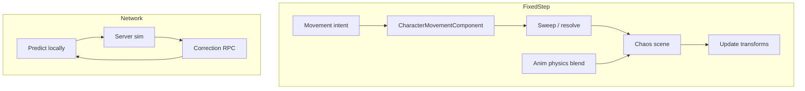
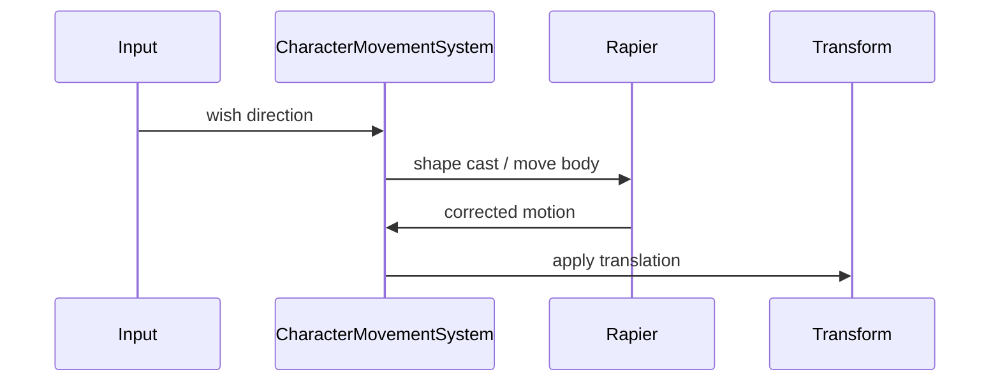

# 07 — Physics and Simulation

## What UE5 Provides

UE5 physics is **Chaos-first**: rigid bodies, destruction, vehicles, cloth, and character movement integrated with networking and animation.

### Chaos Core

| Module | Path | Role |
|--------|------|------|
| Chaos | `Engine/Source/Runtime/Experimental/Chaos/` | PBD rigid/soft bodies, GC internals |
| ChaosCore | `Engine/Source/Runtime/Experimental/ChaosCore/` | Math primitives |
| ChaosSolverEngine | `Engine/Source/Runtime/Experimental/ChaosSolverEngine/` | Solver actors, settings |
| PhysicsCore | `Engine/Source/Runtime/PhysicsCore/` | Scene bridge `FPhysScene_Chaos` |
| PhysScene | `Engine/Public/Physics/Experimental/PhysScene_Chaos.h` | World integration |

### Vehicles

| Component | Path |
|-----------|------|
| ChaosVehiclesCore | `Engine/Source/Runtime/Experimental/ChaosVehicles/` |
| ChaosVehiclesPlugin | `Engine/Plugins/Experimental/ChaosVehiclesPlugin/` |
| Modular vehicle | `Engine/Plugins/Experimental/ChaosModularVehicle/` |

Wheel suspension, transmission, aero models.

### Character Movement

| System | Path | Role |
|--------|------|------|
| CharacterMovementComponent | `Engine/Classes/GameFramework/CharacterMovementComponent.h` | Walk, jump, swim, fly, root motion |
| Network prediction | Implements `INetworkPredictionInterface` |
| Saved moves | `CharacterMovementReplication.h` — server reconciliation |
| Mover (experimental) | `Engine/Plugins/Experimental/Mover/` — successor candidate |
| Lyra | `LyraCharacterMovementComponent` — extends CMC |

**Mover README** documents movement modes, layered moves, Network Prediction backend integration.

### Ragdolls

| Mechanism | Role |
|-----------|------|
| Physics Asset | Per-bone collision bodies |
| `AnimNode_RigidBody` | Physics-driven bones in anim graph |
| PhysicsControl plugin | Active ragdoll / partial sim — `Engine/Plugins/Experimental/PhysicsControl/` |
| Physics Asset Editor | `Engine/Source/Editor/PhysicsAssetEditor/` |

### Networked Physics

| System | Path |
|--------|------|
| NetworkPhysicsComponent | `Engine/Public/Physics/NetworkPhysicsComponent.h` |
| Rewind history | Server reconciliation |
| Network Prediction plugin | `Engine/Plugins/Runtime/NetworkPrediction/readme.txt` |
| Physics binding | `NetworkPredictionPhysicsComponent` |

**Readme notes:** async Network Prediction removed; physics support opt-in and limited.

### Destruction

| System | Path |
|--------|------|
| GeometryCollectionEngine | `Engine/Source/Runtime/Experimental/GeometryCollectionEngine/` |
| GeometryCollectionPlugin | `Engine/Plugins/Experimental/GeometryCollectionPlugin/` |
| Field System | Force fields for fracture |

---

## Why It Exists

| System | Motivation |
|--------|------------|
| **Chaos** | Unified rigid/soft/destructible sim |
| **CMC** | Gameplay-tuned character locomotion beyond raw physics |
| **Prediction** | Responsive MP characters despite latency |
| **Vehicles** | Specialized wheel contact models |
| **Ragdoll** | Death reactions blend animation → physics |
| **Network physics** | Authoritative sim with rewind for interactions |

---

## Core Concepts

### Physics scene

```
UWorld
└── FPhysScene_Chaos
    ├── Chaos solver
    ├── Body instances (per primitive)
    └── Constraints
```

### Character movement modes

| Mode | Description |
|------|-------------|
| Walking | Floor sweep, step up |
| Falling | Gravity |
| Swimming | Fluid volume |
| Flying | No gravity |
| Custom | Project-defined |

### Saved move (MP)

```
FSavedMove
├── Input vector
├── Position/rotation snapshot
└── Server correction pending flag
```

---

## Runtime Flow



### Ragdoll activation

```
Death event → blend skeletal mesh to physics bodies
→ disable CMC → simulate ragdoll in Chaos
```

---

## Editor / Tooling Flow

| Tool | Path |
|------|------|
| Physics Asset Editor | Bone collision authoring |
| Chaos Visual Debugger | `Engine/Source/Programs/ChaosVisualDebugger` |
| Chaos Editor | `Engine/Plugins/Experimental/ChaosEditor` |
| Mover Editor | `Mover/Source/MoverEditor` |

---

## What Bevy Already Has

| Feature | Bevy / ecosystem |
|---------|------------------|
| Physics engine | **`bevy_rapier3d`** (de facto standard) |
| Character controller | `KinematicCharacterController` in Rapier |
| Vehicles | Community crates; nothing official |
| Ragdolls | Manual joint setup + Rapier |
| Destruction | **None** |
| Networked physics | Via `lightyear` + manual sync |
| Cloth | **`bevy_xpbd`** or custom XPBD experiments |

Bevy has no built-in `CharacterMovementComponent` equivalent.

---

## What We Need to Build

| Layer | Crate |
|-------|-------|
| Physics facade | `aa_physics` — Rapier wrapper |
| Character movement | `aa_physics::character` |
| Vehicles | `aa_physics::vehicle` (AA) |
| Ragdoll | `aa_physics::ragdoll` |
| Networked physics | `aa_physics::net` + `aa_net` |
| Destruction | `aa_physics::destruction` (AA, optional) |

---

## Proposed Bevy Physics Abstraction

### Design goals

1. **Backend-agnostic trait** — Rapier today; could swap
2. **ECS-native** — components, no UObject-style body instances
3. **Fixed timestep** — `FixedUpdate` at 60 Hz
4. **Layers / collision matrix** — gameplay filtering

### Component model

```rust
#[derive(Component)]
struct RigidBodyConfig { /* Rapier builder */ }

#[derive(Component)]
struct ColliderConfig { /* shape, layers */ }

#[derive(Component)]
struct CharacterMovement {
    mode: MovementMode,
    max_speed: f32,
    jump_velocity: f32,
    ground_probe: f32,
}
```

### Character controller flow



Map CMC modes to Rapier `KinematicCharacterController` + custom swim/fly volumes.

### Networking integration

| Approach | Use |
|----------|-----|
| **Kinematic character** | Replicate transform + input; predict on client |
| **Dynamic rigid bodies** | `NetworkPhysicsState` component with snapshot interpolation |
| **Ragdoll** | Server authoritative; client interpolate bone transforms |

Follow `NetworkPrediction` *concepts* (rollback buffer) without copying implementation.

---

## Minimum Viable Version (MVP)

| Feature | Choice |
|---------|--------|
| Physics | `bevy_rapier3d` |
| Character | Rapier kinematic controller |
| Modes | Walk + jump only |
| Vehicles | None |
| Ragdoll | None |
| Network | Server authoritative transform sync |
| Layers | 3 groups: Player, World, Projectile |

**Checklist:**
- [ ] `AaPhysicsPlugin` wrapping Rapier
- [ ] `CharacterMovement` + `MovementInput` components
- [ ] Ground detection via downward cast
- [ ] Slope limit + step height
- [ ] Collision layers resource

---

## AA-Quality Version

| Feature | Scope |
|---------|--------|
| Full movement modes | Walk, fall, swim, fly, custom |
| Root motion | Animation-driven translation with sweep |
| Vehicles | Wheel colliders + engine torque model |
| Ragdoll | Physics asset equivalent + animation blend |
| Network prediction | Input buffer + reconciliation |
| Physics rewind | For hit detection / grappling |
| Destruction | Fracture simple geometry collections |
| Chaos debugger equiv | Rapier debug + snapshot export |

---

## Risks and Hard Parts

| Risk | Severity |
|------|----------|
| **CMC parity** | High — years of edge cases (slope, step, net) |
| **Networked kinematic CC** | High — misprediction rubber-banding |
| **Ragdoll net sync** | High — bandwidth + stability |
| **Vehicle tuning** | Medium — requires specialized QA |
| **Destruction** | Very high — optional defer |
| **Rapier coupling** | Medium — abstract early behind traits |

---

## Suggested Rust Crate / Module Boundaries

```
aa_physics/
├── plugin.rs          # Rapier integration
├── layers.rs          # Collision groups matrix
├── rigid/             # Dynamic/static bodies
├── character/
│   ├── movement.rs    # MovementMode, sweeps
│   ├── modes/         # walk, swim, fly
│   └── root_motion.rs # anim-driven
├── vehicle/           # AA — wheel suspension
├── ragdoll/           # AA — bone collider mapping
├── net/
│   ├── prediction.rs  # saved moves buffer
│   └── snapshot.rs    # rigid body history
└── destruction/       # AA — optional GC-style

aa_physics_assets/
├── physics_asset.rs   # Bone → collider mapping asset
└── convex_decomp.rs   # hull generation CLI
```

### System ordering

```
FixedUpdate:
  character_movement_system (before Rapier step)
  rapier_physics_system
  ragdoll_blend_system
  vehicle_system
PostUpdate:
  physics_debug_draw
```

### Lyra lesson

Lyra uses **classic CMC**, not Mover — for Bevy MVP, prioritize kinematic character + Rapier before experimental Mover-equivalent.

---

## UE5 → Bevy Mapping

| UE5 | Proposed |
|-----|----------|
| Chaos | Rapier (via `aa_physics`) |
| `CharacterMovementComponent` | `CharacterMovement` component + systems |
| Mover | AA refactor behind same `MovementController` trait |
| Physics Asset | `PhysicsAsset` RON + bone colliders |
| `AnimNode_RigidBody` | `RagdollActive` + joint motors |
| NetworkPhysicsComponent | `PhysicsNetworkSnapshot` component |
| Geometry Collection | `aa_physics::destruction` (defer) |

---

*Local citations: `CharacterMovementComponent.h`, `PhysScene_Chaos.h`, `NetworkPhysicsComponent.h`, `Engine/Plugins/Experimental/Mover/README.md`, `Engine/Plugins/Runtime/NetworkPrediction/readme.txt`*
