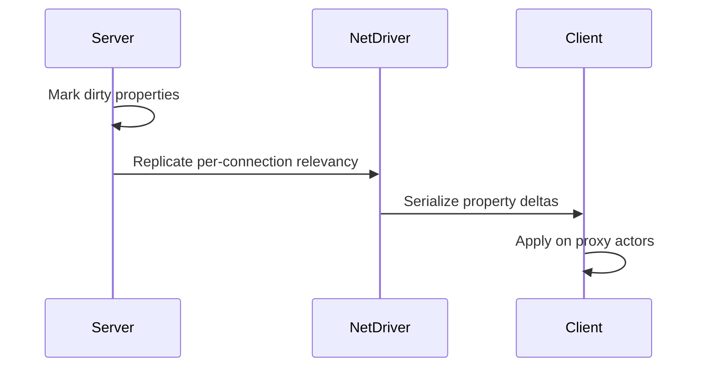
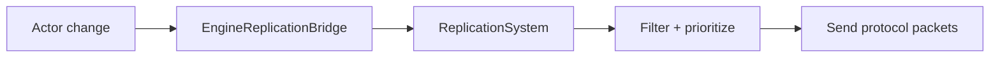
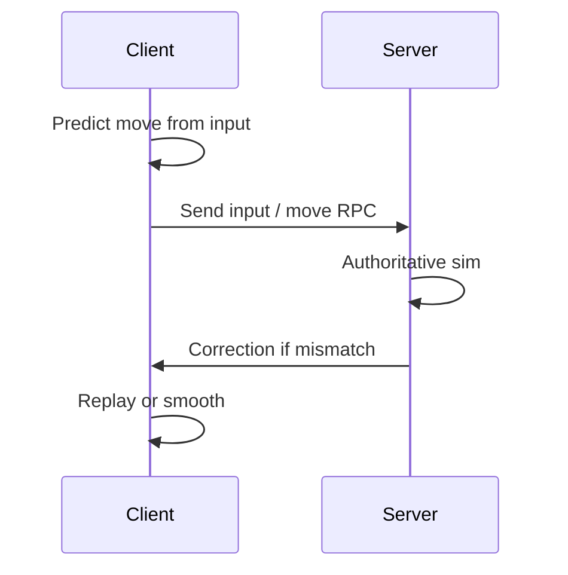
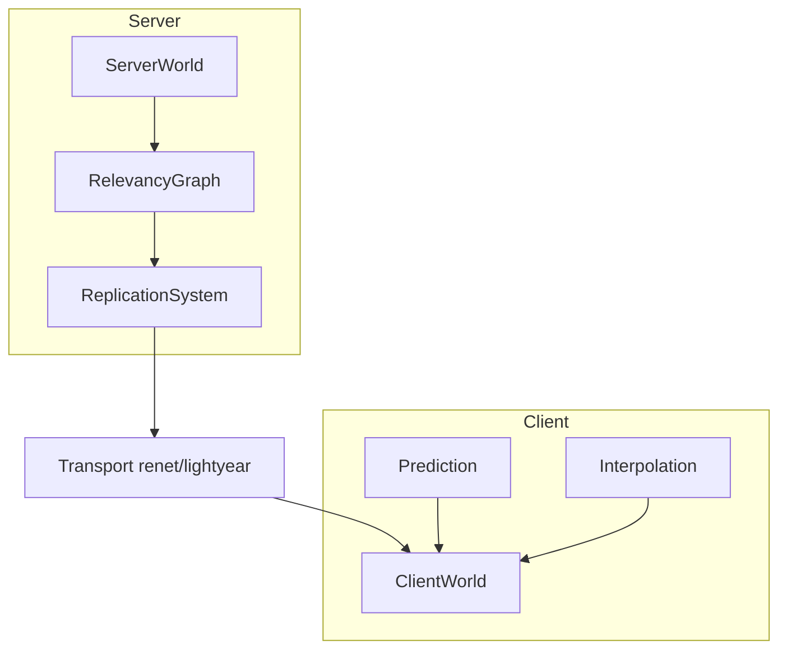

# 08 — Networking

## What UE5 Provides

UE5 multiplayer stacks **property replication**, **RPCs**, **Replication Graph** (relevancy at scale), and **Iris** (next-gen replication pipeline).

### Classic Replication (Engine)

| Concept | Role |
|---------|------|
| `UNetDriver` | Connections, channels, packet send |
| Actor channels | Per-actor replication connection |
| `GetLifetimeReplicatedProps` | Register replicated properties |
| Roles | Authority / Autonomous / Simulated |
| NetGUID | Stable object references across network |
| Push model | Dirty tracking optimization (UE5) |

**Paths:**
- `Engine/Source/Runtime/Engine/Classes/Engine/NetDriver.h`
- `Engine/Source/Runtime/Engine/Classes/GameFramework/Actor.h` (roles)

### RPCs

| Type | Direction |
|------|-----------|
| Server RPC | Client → server |
| Client RPC | Server → owning client |
| Multicast | Server → all clients |

`UFUNCTION(Server, Reliable)`, etc. — UHT-generated.

### Replication Graph

Plugin: `Engine/Plugins/Runtime/ReplicationGraph/`

| Concept | Role |
|---------|------|
| `UReplicationDriver` | Replaces default relevancy loop |
| `UReplicationGraphNode` | Persistent per-connection actor lists |
| Spatial grid node | Distance-based relevancy |
| Always-relevant lists | GameMode, PlayerState, etc. |

**Lyra implementation:** `Samples/Games/Lyra/Source/LyraGame/System/LyraReplicationGraph.cpp`

Documented nodes: spatial grid, always-relevant, per-connection always-relevant, player-state frequency limiter, tear-off.

**Lyra default config:** `Config/DefaultGame.ini` sets `bDisableReplicationGraph=True` — Iris path preferred.

### Iris

Runtime: `Engine/Source/Runtime/Net/Iris/`

| Component | Role |
|-----------|------|
| `UReplicationSystem` | Core Iris replication |
| `EngineReplicationBridge` | UObject ↔ NetRefHandle bridge |
| Filters / prioritizers | Per-class replication rules |
| Protocols | Serialization format per type |

`NetDriver::IsUsingIrisReplication()` routes actors through Iris when enabled.

**Lyra:** `SetupIrisSupport(Target)` in `LyraGame.Build.cs`; filter config in `DefaultEngine.ini`.

### Prediction / Reconciliation

| System | Mechanism |
|--------|-----------|
| Character Movement | Client prediction + server correction |
| GAS | `GameplayPrediction` — ability rollback |
| Network Prediction plugin | Generalized rollback framework |

**GAS rule:** Abilities exist on server + owning client only; simulated proxies use attributes/tags.

---

## Why It Exists

| Design | Motivation |
|--------|------------|
| **Property replication** | Declarative sync from reflection metadata |
| **RPCs** | Event-style actions without polling |
| **Replication Graph** | O(connections × actors) too slow at scale |
| **Iris** | Modern protocol, filtering, bandwidth efficiency |
| **Prediction** | Hide latency for movement and abilities |
| **NetGUID** | Reference objects without pointers |

---

## Core Data Structures (conceptual)

### Connection model

```
UNetDriver
├── ClientConnections[]
├── ReplicationDriver (optional ReplicationGraph)
├── ReplicationSystem (optional Iris)
└── NetworkObjectList
```

### Replication Graph node

```
UReplicationGraphNode
├── GatherActorListsForConnection()
└── Child nodes (grid, always relevant, etc.)
```

### Iris handle

```
NetRefHandle → replicated entity identity
Filter: spatial / no filter / custom
Prioritizer: bandwidth allocation
```

---

## Runtime Flow

### Property replication tick



### Iris path (simplified)



### Client prediction (character)



---

## Editor / Tooling Flow

| Tool | Role |
|------|------|
| Play In Editor (PIE) | Multiplayer preview |
| Network profiler | Bandwidth, replication stats |
| `net pktlag` / `pktloss` | Simulate bad networks |
| Iris debugger | unknown / needs source inspection |

---

## What Bevy Already Has

| UE5 | Bevy ecosystem |
|-----|----------------|
| Built-in replication | **None in core** |
| `lightyear` | Server-authoritative + prediction patterns |
| `bevy_replicon` | Component replication framework |
| `renet` / `renet2` | Low-level UDP transport |
| `matchbox` | WebRTC P2P signaling |
| Iris / RepGraph | **None** |

Bevy requires explicit architecture choices; no reflection-driven replication.

---

## What We Need to Build

| Component | Crate |
|-----------|-------|
| Transport abstraction | `aa_net::transport` |
| Component replication | `aa_net::replicate` |
| RPC / events | `aa_net::rpc` |
| Relevancy graph | `aa_net::relevancy` |
| Prediction | `aa_net::predict` |
| Serialization | `aa_net::protocol` (bitcode/bincode) |

---

## Proposed Bevy Multiplayer Architecture



### Component replication model

```rust
#[derive(Component, Replicate)]
struct Health {
    #[replicate(predicted)]
    current: f32,
    max: f32,
}

#[derive(Component, Replicate)]
struct TransformSnapshot {
    translation: Vec3,
    rotation: Quat,
}
```

Derive macro marks:
- **Authority** — server owns
- **Predicted** — client may speculatively update
- **Interpolated** — smooth on simulated proxies

### Relevancy graph (ReplicationGraph equivalent)

```rust
struct RelevancyGraph {
    spatial_grid: SpatialGrid<NetEntityId>,
    always_relevant: HashSet<NetEntityId>,
    per_player_lists: HashMap<PlayerId, Vec<NetEntityId>>,
}
```

Run graph on server each tick to build per-connection replicate sets.

### Iris-equivalent concepts (without copying protocol)

| Iris concept | Bevy equivalent |
|--------------|-----------------|
| NetRefHandle | `NetEntityId` (stable mapping) |
| Filter | `ReplicationFilter` per component type |
| Prioritizer | Bandwidth budget per player |
| Bridge | `WorldEntityMap` ECS entity ↔ net id |

### RPC design

```rust
// Events, not UFUNCTION
#[derive(Event, Serialize, Deserialize)]
struct FireWeaponEvent { weapon_id: u32, direction: Vec3 }

// Server system consumes from client channel
// Client system receives multicast from server
```

### Integration with GAS (`aa_ability`)

| Data | Replication strategy |
|------|---------------------|
| Attributes | Replicated component, predicted where needed |
| Tags | `TagContainer` sync |
| Abilities | Server grant + client activate with prediction token |
| Cues | Multicast cosmetic events |

---

## Minimum Viable Version (MVP)

| Feature | Scope |
|---------|-------|
| Transport | `renet` or `lightyear` |
| Players | 2–8 players LAN |
| Sync | Transform + health only |
| Authority | Server-only simulation |
| RPCs | 3 typed events (fire, damage, spawn) |
| Relevancy | Distance check radius only |
| No prediction | Except optional client interpolation |

**Checklist:**
- [ ] `aa_net` plugin with server/client modes
- [ ] `Replicated` derive for 5 components
- [ ] `NetEntityId` mapping resource
- [ ] Simple spatial relevancy (50m radius)
- [ ] PIE equivalent: `cargo run -- server` + `cargo run -- client`

---

## AA-Quality Version

| Feature | Scope |
|---------|--------|
| Replication graph | Spatial grid + always-relevant + frequency limiter |
| Iris-style filters | Per-component-type rules |
| Prediction | Character movement + ability rollback |
| Bandwidth limits | Prioritizer per connection |
| Dedicated server | Headless `aa_server` binary |
| NAT / matchmaking | Integration hook (not full EOS) |
| Replay | Snapshot recording (optional) |
| Network stats | In-game overlay + Tracy spans |

---

## Risks and Hard Parts

| Risk | Severity |
|------|----------|
| **No reflection replication** | Every component hand-registered |
| **ECS entity mapping** | Stable IDs across spawn/despawn |
| **Prediction rollback** | Hard with Rapier + animation |
| **Bandwidth at scale** | Need ReplicationGraph equivalent |
| **Crate maturity** | `lightyear`/`replicon` API churn — pin versions |
| **Cheat protection** | Server validation for all RPCs |

---

## Suggested Rust Crate / Module Boundaries

```
aa_net/
├── transport/
│   ├── renet.rs
│   └── lightyear.rs   # feature flag
├── protocol/
│   ├── encode.rs
│   └── component.rs   # Replicate derive
├── rpc/
│   ├── client.rs
│   └── server.rs
├── relevancy/
│   ├── graph.rs       # ReplicationGraph nodes
│   └── spatial.rs
├── predict/
│   ├── buffer.rs      # input history
│   └── rollback.rs
├── bridge/
│   └── entity_map.rs  # NetEntityId ↔ Entity
└── server/
    └── dedicated.rs   # headless binary
```

### Schedule

```
PreUpdate:
  net_receive_system
  prediction_apply_input
FixedUpdate:
  authoritative_simulation (server)
  predicted_simulation (client)
PostUpdate:
  replication_send_system
  interpolation_system (simulated proxies)
```

---

## Lyra Networking Lessons

| Lyra choice | Bevy recommendation |
|-------------|---------------------|
| Iris enabled | Build filter registry early |
| ReplicationGraph shipped but disabled | Implement relevancy graph as optional module |
| ASC on PlayerState | Replicate player-state entity components |
| Custom struct serializer for target data | Explicit protocol types in `aa_net::protocol` |

---

## UE5 → Bevy Mapping

| UE5 | Proposed |
|-----|----------|
| `UNetDriver` | `AaNetPlugin` + transport |
| Property replication | `#[derive(Replicate)]` components |
| RPC | Typed `Event` + channels |
| ReplicationGraph | `aa_net::relevancy::Graph` |
| Iris | `ReplicationSystem` resource (conceptual port) |
| NetGUID | `NetEntityId` map |
| Push model | Change detection on replicated components |

---

*Local citations: `NetDriver.h`, `Engine/Plugins/Runtime/ReplicationGraph/Source/Public/ReplicationGraph.h`, `Engine/Source/Runtime/Net/Iris/`, `Samples/Games/Lyra/Source/LyraGame/System/LyraReplicationGraph.cpp`, `LyraGame.Build.cs`*
