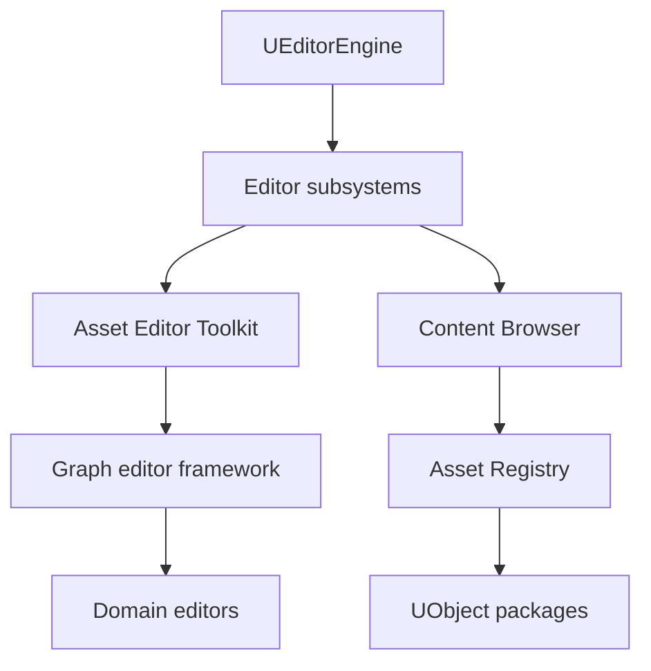
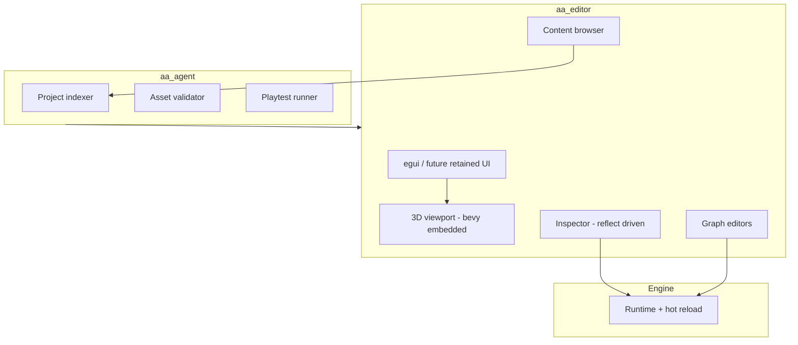
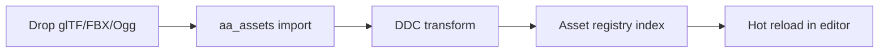

# 09 — Editor and Tooling

## What UE5 Provides

The Unreal Editor is a **monolithic desktop application** composed of ~143 editor modules and hundreds of plugins, providing visual authoring for every asset type.

### Editor Core

| Module | Path | Role |
|--------|------|------|
| UnrealEd | `Engine/Source/Editor/UnrealEd/` | Editor hub |
| LevelEditor | `Engine/Source/Editor/LevelEditor/` | Viewport, placement |
| ContentBrowser | `Engine/Source/Editor/ContentBrowser/` | Asset discovery |
| PropertyEditor | `Engine/Source/Editor/PropertyEditor/` | Reflection-driven details panel |
| EditorSubsystem | `Engine/Source/Editor/EditorSubsystem/` | Extensible editor services |

### Major Asset Editors

| Editor | Path | Asset type |
|--------|------|------------|
| Blueprint / Kismet | `Engine/Source/Editor/Kismet/`, `BlueprintGraph/` | Visual scripting |
| Material Editor | `Engine/Source/Editor/MaterialEditor/` | Materials |
| Persona | `Engine/Source/Editor/Persona/` | Skeleton, animation |
| Animation Blueprint | `AnimationBlueprintEditor/` | Anim graphs |
| Sequencer | `Engine/Source/Editor/Sequencer/` | Cinematics |
| Niagara | `Engine/Plugins/FX/Niagara/` | VFX systems |
| Static Mesh Editor | `StaticMeshEditor/` | Meshes + Nanite |
| Physics Asset Editor | `PhysicsAssetEditor/` | Ragdoll |
| Control Rig Editor | `ControlRig/Source/ControlRigEditor` | Rigs |
| Data Table | `DataTableEditor/` | Tabular data |

### Niagara (VFX)

Plugin: `Engine/Plugins/FX/Niagara/Niagara.uplugin`

| Module | Role |
|--------|------|
| NiagaraCore | Foundation |
| Niagara | Simulation |
| NiagaraEditor | Node graph authoring |
| NiagaraAnimNotifies | Animation hooks |

Depends on `PythonScriptPlugin` for scripting integration.

### Python / Editor Scripting

| Plugin | Role |
|--------|------|
| PythonScriptPlugin | Editor automation via Python |
| Blutility | Editor utility widgets |

### Asset Import Pipeline

| Stage | Tool |
|-------|------|
| FBX/glTF import | Asset import factories in UnrealEd |
| Derived Data Cache | Texture/mesh processing |
| Data validation | `DataValidation` plugin |
| Source control | Perforce/Git plugins |

### Profiler / Debugger

| Tool | Role |
|------|------|
| Unreal Insights | Trace-based profiling |
| Session Frontend | Stats, logs |
| RenderDoc | GPU capture |
| `stat unit`, `stat gpu` | In-editor CVars |
| Network profiler | MP bandwidth |
| Chaos Visual Debugger | Physics debug |

---

## Why It Exists

| Design | Motivation |
|--------|------------|
| **Reflection-driven UI** | One metadata source for details panel + BP |
| **Per-asset editors** | Domain-specific authoring (material graph ≠ anim graph) |
| **Monolithic editor** | Shared selection, undo, asset registry |
| **Visual scripting** | Designer accessibility |
| **Python scripting** | Pipeline automation at AAA studios |
| **DDC** | Fast reimport on large teams |

---

## Core Editor Architecture (conceptual)



### Undo / transaction model

Editor mutations wrap in `FScopedTransaction` for unified undo.

### Asset workflow

```
Import → Asset Registry index → Edit in specialized editor
→ Save package → DDC rebuild → Cook (UAT)
```

---

## Runtime vs Editor Flow

| Phase | Editor | Runtime |
|-------|--------|---------|
| Authoring | Full asset metadata + thumbnails | — |
| Cook | Strip editor-only properties | Platform formats |
| Play | PIE uses uncooked assets | Shipped build uses cooked |

---

## What Bevy Already Has

| UE5 editor feature | Bevy |
|------------------|------|
| Official editor | **None** (third-party tools exist) |
| `bevy_editor_core` | Experimental internal crates |
| Inspector | `bevy-inspector-egui` (ecosystem) |
| Scene editor | Community tools (`bevy_mod_picking`, etc.) |
| Material editor | None |
| Visual scripting | None |
| Sequencer | None |
| Asset pipeline | glTF manual import |
| Profiler | `tracing` + Tracy support in Bevy |

**Fyrox** (different engine) has a full editor — not Bevy-native.

---

## What We Need to Build

An **AI-native editor** should not replicate Unreal's 20-year monolith day one. Instead:

| Phase | Deliverable |
|-------|-------------|
| MVP | egui-based scene inspector + asset browser |
| AA | Domain editors for materials, animation, VFX |
| Differentiator | Agent-driven authoring (see ch.10) |

---

## Proposed AI-Native Bevy Editor



### Editor technology choices

| Option | Pros | Cons |
|--------|------|------|
| **egui** (`bevy_egui`) | Fast, Rust-native | Not AAA UI polish |
| **iced / slint** | Retained mode | Less Bevy integration |
| **Web UI (Tauri)** | Rich UI, AI-friendly | IPC complexity |
| **Embedded Bevy viewport** | Same renderer | Input focus challenges |

**Recommendation:** MVP with `bevy_egui`; evaluate Tauri for AA if AI agent UI needs rich diff/review.

### Domain editor priorities

| Priority | Editor | Rationale |
|----------|--------|-----------|
| P0 | Scene / level | Placement, transforms, components |
| P0 | Asset browser | Discovery + import |
| P1 | Material | Rendering iteration |
| P1 | Animation graph | Locomotion tuning |
| P2 | Sequencer | Cinematics |
| P2 | VFX graph | Niagara equivalent |
| P3 | Blueprint | Defer — Rust + AI codegen instead |

### VFX (Niagara equivalent)

| Approach | Notes |
|----------|-------|
| Integrate `bevy_hanabi` | GPU particles, less graph authoring |
| Build `aa_vfx` node graph | AA — modular spawn, forces, collision |
| Niagara parity | Not realistic — scope to game needs |

### Sequencer equivalent

| Feature | Implementation |
|---------|----------------|
| Tracks | Entity property keys over time |
| Spawnables | Prefab spawn track |
| Camera cuts | Camera component keys |
| Integration | `bevy_tween` / custom curve evaluator |

### Asset import pipeline



---

## Minimum Viable Version (MVP)

| Feature | Scope |
|---------|-------|
| UI | `bevy_egui` docking panels |
| Viewport | Same Bevy app with `EditorState` resource |
| Hierarchy | Entity tree |
| Inspector | Manual component widgets for 10 types |
| Assets | Folder browser + glTF drag-drop |
| Play | Toggle `EditorState` → `PlayState` |
| Undo | Command stack for transform edits only |
| Scripting | None — Rust hot reload via `cargo watch` |

**Checklist:**
- [ ] `aa_editor` crate with feature gate
- [ ] Entity selection + gizmo translate
- [ ] Save/load scene RON
- [ ] Import glTF to assets folder
- [ ] Tracy profiling overlay toggle

---

## AA-Quality Version

| Feature | Scope |
|---------|-------|
| Reflection inspector | Auto UI from `aa_reflect` |
| Material graph editor | Node graph → WGSL |
| Animation graph editor | State machine visual |
| Sequencer | Multi-track timeline |
| VFX editor | `aa_vfx` graph |
| DDC + import rules | Validated pipeline |
| Multi-user editing | Optional — defer or use git |
| Python | **Skip** — use Rust agent API instead |
| Plugin SDK | Editor extensions crate |

---

## Risks and Hard Parts

| Risk | Severity |
|------|----------|
| **Editor scope creep** | Critical — UnrealEd is thousands of engineer-years |
| **Viewport embedding** | Medium — dual App or single App with state |
| **Undo across systems** | High — unified transaction model needed |
| **Graph editors** | High — each is a product (material, anim, VFX) |
| **Artist adoption** | High — without BP, need AI + data assets |

---

## Suggested Rust Crate / Module Boundaries

```
aa_editor/
├── shell/           # Window, docking, menus
├── viewport/        # Camera, gizmo, picking
├── hierarchy/       # Entity tree UI
├── inspector/       # Reflect-driven property UI
├── content/         # Asset browser
├── undo/            # Command pattern stack
├── graphs/
│   ├── core/        # Shared graph UI framework
│   ├── material/
│   ├── animation/
│   └── vfx/
├── sequencer/       # Timeline (AA)
└── import/          # Asset import wizards

aa_editor_protocol/  # IPC for external agents (JSON-RPC)
```

### Graph editor framework (shared)

```rust
// Conceptual shared IR
struct GraphDocument {
    nodes: Vec<GraphNode>,
    edges: Vec<(NodeId, NodeId, Pin)>,
}
// Domain-specific evaluators live in runtime crates
```

---

## UE5 → Bevy Mapping

| UE5 | Proposed |
|-----|----------|
| UnrealEd | `aa_editor::shell` |
| Content Browser | `aa_editor::content` |
| Details panel | `aa_editor::inspector` + `aa_reflect` |
| Blueprint | Rust + `aa_agent` codegen (not visual clone) |
| Material Editor | `aa_editor::graphs::material` |
| Persona / AnimBP | `aa_editor::graphs::animation` |
| Sequencer | `aa_editor::sequencer` |
| Niagara | `aa_editor::graphs::vfx` + `bevy_hanabi` |
| Python scripting | `aa_agent` + `aa_editor_protocol` |
| Unreal Insights | Tracy + custom `aa_trace` |

---

*Local citations: `Engine/Source/Editor/UnrealEd/`, `Engine/Source/Editor/MaterialEditor/`, `Engine/Plugins/FX/Niagara/Niagara.uplugin`, `Engine/Source/Editor/Sequencer/`*
