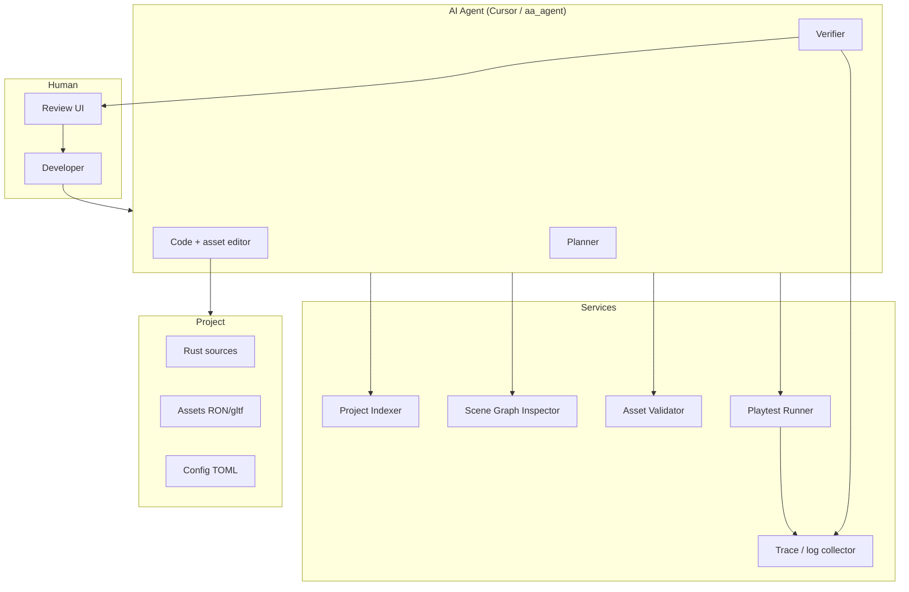
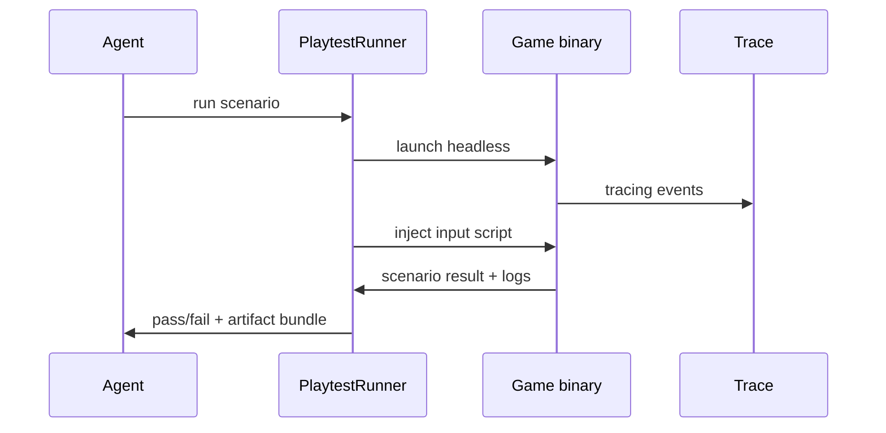
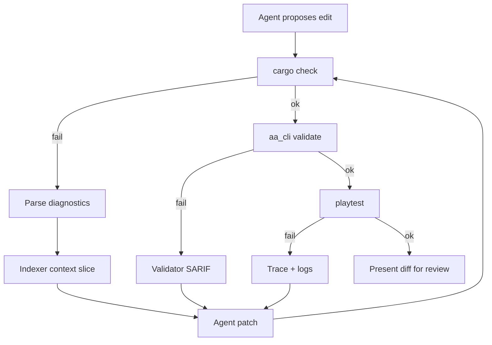

# 10 — AI-Native Game Studio

## Purpose

This chapter defines how a **Cursor-like AI agent** should interact with a Bevy game project — the differentiator for an open-source AA stack that skips Unreal's 30-year editor monolith in favor of **agent-augmented development**.

UE5 has Python scripting and asset tools; it does **not** provide an integrated AI repair loop. This layer is **greenfield**.

---

## Design Goals

| Goal | Rationale |
|------|-----------|
| **Agent-safe project model** | Text-first assets (RON/TOML/Rust) agents can read/write |
| **Verifiable changes** | Compile, run, playtest after every edit |
| **Bounded context** | Indexer provides relevant slices, not whole repo |
| **Human review** | Diff/review workflow before merge |
| **Closed-loop repair** | Error → diagnose → patch → re-verify |

---

## Architecture Overview



---

## Agent Interaction Surfaces

### 1. Project Indexer

**Purpose:** Provide structured project knowledge without dumping the entire repo into context.

| Index type | Contents |
|------------|----------|
| **Symbol index** | `rust-analyzer` / `syn` — structs, systems, components |
| **Asset index** | Path, type, dependencies, hash |
| **Scene index** | Entity hierarchy summaries per scene |
| **Config index** | Merged config keys + sources |
| **Doc index** | `docs/`, design markdown |

**Output format (agent-consumable):**

Normative schema: `docs/specs/schemas/index_result.schema.json`

```json
{
  "ok": true,
  "query": "abilities related to fire damage",
  "duration_ms": 42,
  "hits": [
    {
      "id": "FireDamageEffect",
      "kind": "code_symbol",
      "path": "crates/aa_ability/src/effects/fire.rs",
      "score": 0.95,
      "summary": "FireDamageEffect applies burning tag",
      "relations": [{ "kind": "references", "target": "GameplayTag::Burning" }],
      "stale": false
    }
  ]
}
```

**Implementation crate:** `aa_agent::indexer`

| Source | Tool |
|--------|------|
| Rust | `rust-analyzer` metadata or `syn` scrape |
| Assets | `aa_assets::registry` manifest |
| Scenes | RON parse → entity graph summary |

**Refresh triggers:**
- File watcher on `assets/`, `src/`, `config/`
- Incremental re-index on save

### 2. Scene Graph Inspector

**Purpose:** Let agents query and mutate world structure safely.

| Operation | API |
|-----------|-----|
| List entities | `scene.list(filter: With<Health>)` |
| Inspect | `scene.inspect(entity_id) → components JSON` |
| Spawn prefab | `scene.spawn("prefabs/enemy.orc", transform)` |
| Add component | `scene.add_component(id, ComponentPatch)` |
| Remove | `scene.despawn(id)` |

**Transport:** JSON-RPC over stdio or HTTP (`aa_editor_protocol`)

**Safety rules:**
- Mutations only in `Editor` or `Playtest` sessions
- Schema validation before apply
- Undo token returned per mutation batch

### 3. Asset Validator

**Purpose:** Catch broken references before playtest.

| Check | Example failure |
|-------|-----------------|
| Missing mesh ref | `Handle<Mesh>` path not in registry |
| Invalid RON schema | Typo in `GameplayEffect` |
| Tag not defined | `Ability.Cooldown.Fire` missing from dictionary |
| Cyclic prefab ref | A → B → A |
| Navmesh stale | Sector nav doesn't match geometry hash |
| Shader compile | WGSL/naga error |

**Implementation:**

```
aa_cli validate
  → asset_validator (parallel checks)
  → exit code 0 / non-zero + SARIF report
```

**Agent loop:** Validator output feeds repair prompts with file:line.

### 4. Playtest Runner

**Purpose:** Headless or interactive smoke test after changes.

| Mode | Description |
|------|-------------|
| **Headless** | `aa_cli playtest --scenario intro_mission --duration 30s` |
| **Recorded** | Capture input script, replay deterministically |
| **Assertions** | Scenario expects: `player.health > 0`, `enemy.count == 0` |



**Artifacts:**
- `playtest_report.json`
- Tracy capture path
- Screenshot frames (if GPU available)
- Stderr with panics

### 5. Error Repair Loop



**Guardrails:**
- Max repair iterations (e.g. 5)
- No auto-commit without human approval
- Block edits to `Cargo.lock` without explicit intent

### 6. Diff / Review Workflow

| Step | Tool |
|------|------|
| Agent stages edits | Working tree changes |
| Generate diff | `git diff` + asset binary summaries |
| Human review | Cursor review UI / PR |
| Accept | Commit with trace linking playtest report |

**Asset diffs:** Text formats (RON) diff cleanly; glTF show mesh hash + vertex count delta.

---

## How Cursor-Like Agents Should Work

### Context budget strategy

| Priority | Include |
|----------|---------|
| P0 | Changed files + direct imports |
| P1 | Indexer hits for query symbols |
| P2 | Scene slice around selected entity |
| P3 | Related `docs/research/` architecture |
| Avoid | Full `target/`, `.git`, binary meshes |

### Recommended agent tools (MCP / CLI)

| Tool name | Function |
|-----------|----------|
| `project_search` | Semantic + symbol search via indexer |
| `scene_inspect` | Entity/component query |
| `scene_patch` | Validated scene mutations |
| `validate_assets` | Run validator |
| `playtest` | Execute scenario |
| `cargo_check` | Fast compile verify |
| `config_get` | Merged config key lookup |

### Prompt conventions

Store in `.cursor/rules` or `AGENTS.md`:

```markdown
- Prefer RON assets over hardcoded Rust for gameplay tuning
- Run `aa_cli validate` before claiming task complete
- Ability changes must update tag dictionary
- Never edit generated shader cache
```

---

## Integration with Engine Crates

| Crate | Agent touchpoint |
|-------|------------------|
| `aa_reflect` | Inspector schema + validator |
| `aa_scene` | Scene graph API |
| `aa_assets` | Registry + import |
| `aa_ability` | Effect/ability RON schemas |
| `aa_cli` | Unified agent command surface |
| `aa_editor_protocol` | JSON-RPC for running editor |

---

## Minimum Viable Version (MVP)

| Feature | Scope |
|---------|-------|
| Indexer | `rg` + `rust-analyzer` symbol export JSON |
| Validator | glTF exists + RON parse + `cargo check` |
| Playtest | Launch game 10s headless, exit 0 |
| Agent API | `aa_cli agent dump-index` |
| Repair loop | Manual — agent runs CLI commands |

**Checklist:**
- [ ] `aa_cli validate` command
- [ ] `aa_cli playtest --duration 10s`
- [ ] `AGENTS.md` project conventions
- [ ] JSON scene summary export
- [ ] SARIF output for validation errors

---

## AA-Quality Version

| Feature | Scope |
|---------|-------|
| Semantic indexer | Embeddings over design docs + code |
| Live scene RPC | Editor exposes JSON-RPC |
| Scenario library | 20+ playtest missions |
| Auto-repair | Agent loop with iteration cap |
| CI integration | GitHub Action runs validate + playtest |
| Permission model | Agent can/cannot touch paths |
| Multi-agent | Planner + implementer + verifier roles |

---

## Risks and Hard Parts

| Risk | Mitigation |
|------|------------|
| Nondeterministic playtests | Fixed seed + input replay |
| Agent breaks binary assets | Text-first authoring policy |
| Context hallucination | Validator + compile gates |
| Slow iteration | Incremental index + `cargo check` not full build |
| Security | Agent RPC only on localhost; path allowlist |

---

## Suggested Rust Crate / Module Boundaries

```
aa_agent/
├── indexer/
│   ├── rust_index.rs
│   ├── asset_index.rs
│   └── search.rs
├── validator/
│   ├── rules/
│   └── sarif.rs
├── playtest/
│   ├── runner.rs
│   ├── scenarios/
│   └── assertions.rs
├── protocol/
│   └── jsonrpc.rs
└── repair/
    └── loop.rs          # orchestration helper

aa_cli/
├── cmd_validate.rs
├── cmd_playtest.rs
├── cmd_index.rs
└── cmd_scene.rs
```

---

## Comparison to UE5 Tooling

| Capability | UE5 | AI-native Bevy studio |
|------------|-----|----------------------|
| Visual scripting | Blueprint | Rust + agent codegen + data assets |
| Editor Python | Automation scripts | Agent + `aa_cli` |
| Asset validation | DataValidation plugin | `aa_agent::validator` |
| CI cook | UAT | `aa_cli validate + playtest` |
| Documentation | Manual | Indexer + architecture atlas |
| Repair loop | Manual programmer | Agent closed-loop with gates |

---

## Success Metrics

| Metric | Target |
|--------|--------|
| Time to implement new ability | <30 min with agent assist |
| Validator catch rate | >90% broken refs before runtime |
| Playtest regression | <2 min per scenario in CI |
| Agent repair success | >70% compile errors auto-fixed |

---

*This layer is original architecture — not derived from UE5 source. Complements ch.09 editor tooling.*
