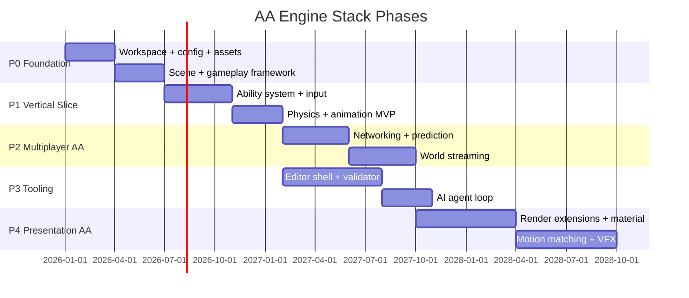
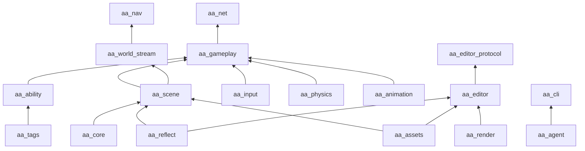

# 11 — Bevy Roadmap

## Executive Summary

This roadmap phases delivery of an **AA-capable Bevy engine stack** inspired by UE5 responsibilities. It assumes a **small core team (3–8 engineers)** and leverages Bevy 0.16+ and ecosystem crates.

**Non-goal:** Feature parity with UE5 rendering (Nanite/Lumen) or Blueprint within 36 months.

**Goal:** Shippable multiplayer action-adventure with modular gameplay, streaming worlds, agent-friendly tooling.

---

## Phase Overview



---

## Phase 0 — Foundation (Months 1–6)

### Objectives
- Bootable workspace matching `01_engine_architecture`
- ECS-native scene model matching `02_object_model_vs_ecs`

### Deliverables

| Crate | Features |
|-------|----------|
| `aa_core` | App plugin, schedules, config merge, CVars |
| `aa_scene` | Prefabs, spawn API, possession relationships |
| `aa_assets` | glTF loader, asset manifest, hot reload |
| `aa_reflect` | Derive reflect, RON serialize |
| `aa_cli` | `new`, `run`, `check` |

### Exit criteria
- [ ] Example app spawns player pawn from RON prefab
- [ ] Config loads `engine.toml` + `game.toml` with overrides
- [ ] `cargo run -p example_game` works on macOS + Windows

### Team focus
- 2 engineers: core + assets
- 1 engineer: CLI + project template

---

## Phase 1 — Gameplay Vertical Slice (Months 7–13)

### Objectives
- Playable single-player combat loop
- Lyra-inspired patterns without copying (`03_gameplay_framework`)

### Deliverables

| Crate | Features |
|-------|----------|
| `aa_tags` | Tag hierarchy + queries |
| `aa_ability` | Attributes, effects, 5 abilities, cooldowns |
| `aa_input` | Mapping contexts + actions |
| `aa_gameplay` | GameMode, PlayerState, possession |
| `aa_physics` | Rapier wrapper + character movement |
| `aa_animation` | Locomotion FSM + clip blend |
| `aa_experience` | Experience definition loader |

### Exit criteria
- [ ] 10-minute demo: move, aim, fire, damage, death, respawn
- [ ] Data-driven abilities in RON
- [ ] Footstep anim notifies → SFX

### Dependencies
- Bevy 0.16+ pinned
- `bevy_rapier3d` pinned

---

## Phase 2 — Multiplayer + Open World (Months 14–21)

### Objectives
- 8-player networked slice
- Sector streaming prototype (`04_world_streaming`, `08_networking`)

### Deliverables

| Crate | Features |
|-------|----------|
| `aa_net` | Component replication, RPC events, spatial relevancy |
| `aa_world_stream` | 3×3 grid, async sector load |
| `aa_nav` | Recast per sector |
| `aa_crowd` | 500-agent ISM crowd (optional milestone) |

### Exit criteria
- [ ] 8 clients LAN deathmatch on streamed map
- [ ] Server dedicated binary
- [ ] Attributes + transforms replicate correctly
- [ ] Sector load/unload without crash

### Risks gate
- If prediction fails MVP: ship server-auth with interpolation only

---

## Phase 3 — Editor + AI Studio (Months 10–21, parallel)

### Objectives
- Agent-friendly development (`09_editor_tooling`, `10_ai_native_game_studio`)
- Can start after Phase 1 month 3

### Deliverables

| Crate | Features |
|-------|----------|
| `aa_editor` | Viewport, hierarchy, inspector, gizmos |
| `aa_agent` | Indexer, validator, playtest runner |
| `aa_editor_protocol` | JSON-RPC scene API |

### Exit criteria
- [ ] Designer places entities in editor, saves scene RON
- [ ] `aa_cli validate` catches broken refs
- [ ] `aa_cli playtest` runs 60s scenario in CI
- [ ] Cursor agent completes "add fire ability" task via CLI

---

## Phase 4 — Presentation AA (Months 22–33)

### Objectives
- Visual fidelity competitive with AA indie 3D (`05_rendering_stack`, `06_animation_stack`)

### Deliverables

| Crate | Features |
|-------|----------|
| `aa_render` | Scalability, post-process, material graph |
| `aa_mesh_builder` | Virtual geometry offline builder |
| `aa_animation` | Blend spaces, IK, motion matching DB |
| `aa_vfx` | Particle graph or `bevy_hanabi` integration |

### Exit criteria
- [ ] 3 scalability presets (Low/Med/High)
- [ ] Material editor creates custom PBR variant
- [ ] Motion-matched locomotion on hero character
- [ ] Virtual geometry on static environment set

---

## Crate Dependency Graph



---

## Build vs Integrate Decisions

| System | Decision | Crate |
|--------|----------|-------|
| Physics | **Integrate** Rapier | `bevy_rapier3d` |
| Networking transport | **Integrate** | `lightyear` or `renet2` |
| Particles MVP | **Integrate** | `bevy_hanabi` |
| UI editor | **Integrate** | `bevy_egui` |
| GAS | **Build** | `aa_ability` |
| World Partition | **Build** | `aa_world_stream` |
| Lumen GI | **Defer** | probe DDGI in Phase 4+ |
| Blueprint | **Skip** | AI + RON + Rust |
| Sequencer | **Build** minimal | Phase 4 |
| EOS/Steam | **Integrate** when needed | platform crates |

---

## Milestone Checklist (Master)

### MVP (Month 13)
- [ ] Single-player combat slice
- [ ] RON abilities + tags
- [ ] Character movement + animation FSM
- [ ] glTF assets + hot reload
- [ ] Basic editor scene placement
- [ ] `aa_cli validate`

### AA (Month 33)
- [ ] 8-player networked streamed world
- [ ] Replication graph + prediction subset
- [ ] Experience + game feature plugins
- [ ] Material + animation graph editors
- [ ] Motion matching locomotion
- [ ] Virtual geometry environments
- [ ] AI agent repair loop in CI
- [ ] Scalability presets

---

## Team Roles

| Role | Phase focus |
|------|-------------|
| **Engine architect** | Core, net, streaming |
| **Gameplay engineer** | Abilities, input, experience |
| **Graphics engineer** | Render, VFX, mesh builder |
| **Animation engineer** | Graph, IK, motion match |
| **Tools engineer** | Editor, agent, CLI |
| **Tech designer** | RON schemas, playtest scenarios |

Minimum viable team: architect + gameplay + tools (3).

---

## Risk Register

| ID | Risk | Phase | Mitigation |
|----|------|-------|------------|
| R1 | Bevy API churn | All | Facade crates (`aa_*`), pin versions |
| R2 | Networking prediction | P2 | Fallback server-auth |
| R3 | Editor scope | P3 | egui MVP only |
| R4 | GI complexity | P4 | Baked probes first |
| R5 | Open source funding | All | Modular crates, sponsor milestones |
| R6 | Artist pipeline | P3+ | AI-assisted material/VFX |

---

## Lyra-Equivalent Example Game

Target: `examples/lyra_equivalent/` — **not a port**, a reference layout.

| Lyra concept | Our equivalent |
|--------------|----------------|
| `ULyraExperienceDefinition` | `experience.ron` |
| Game Feature plugins | Cargo feature crates `feature_shooter/` |
| `LyraAbilitySystemComponent` | `AbilityRegistry` on PlayerState entity |
| `LyraReplicationGraph` | `aa_net::relevancy::Graph` |
| ShooterCore plugin | `feature_shooter` crate |

### Suggested folder layout

```
examples/lyra_equivalent/
├── Cargo.toml
├── aa.project.toml
├── config/
├── assets/
├── features/
│   ├── shooter_core/
│   └── top_down/
└── src/
    ├── main.rs
    ├── game_mode.rs
    └── experience.rs
```

---

## Version Pinning Policy

| Dependency | Policy |
|------------|--------|
| `bevy` | Pin minor; upgrade quarterly |
| `bevy_rapier3d` | Pin to compatible Bevy version |
| `lightyear` | Pin; test prediction each upgrade |
| Internal `aa_*` | Workspace unified version `0.1.0` until AA |

---

## Success Definition

The stack succeeds when a team can ship a **multiplayer action-adventure** with:

1. Data-driven abilities and experiences
2. Streaming open world (sector grid)
3. Agent-assisted content iteration (`aa_cli validate + playtest`)
4. Visual quality at AA indie tier (not UE5 film tier)

---

## Reading Order for Implementers

1. `00_overview.md` — map
2. `01_engine_architecture.md` — workspace setup
3. `02_object_model_vs_ecs.md` — entity design rules
4. **`12_integration_blueprint.md`** — master wiring (read before coding)
5. **`13_data_schemas.md` + `14_system_schedule_spec.md`** — contracts
6. **`15_phase0_bootstrap_guide.md`** — create workspace (Phase 0 hands-on)
7. **`16_anti_patterns_and_decisions.md`** — keep open while coding
8. `03_gameplay_framework.md` — abilities (Phase 1)
9. `08_networking.md` + `04_world_streaming.md` — MP world (Phase 2)
10. `17_agent_cli_contract.md` + `AGENTS.md` — Cursor app integration (Phase 3)
11. This document — phased execution

---

*Roadmap is planning artifact — adjust dates per team size. All UE5 references are responsibility mappings only.*
