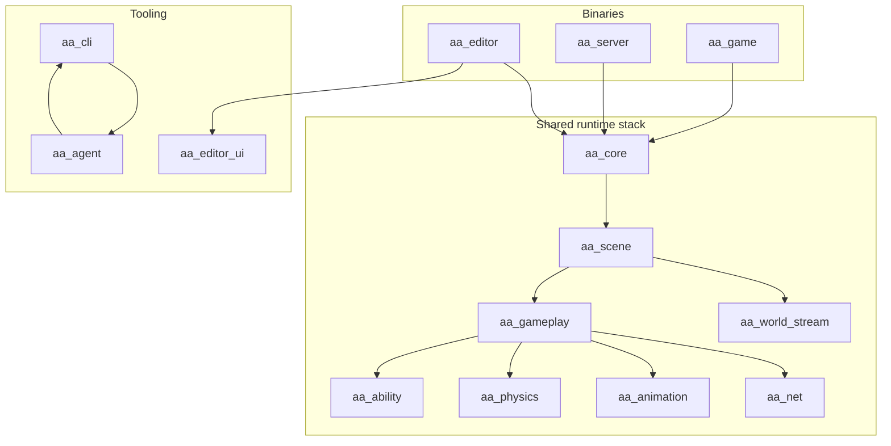
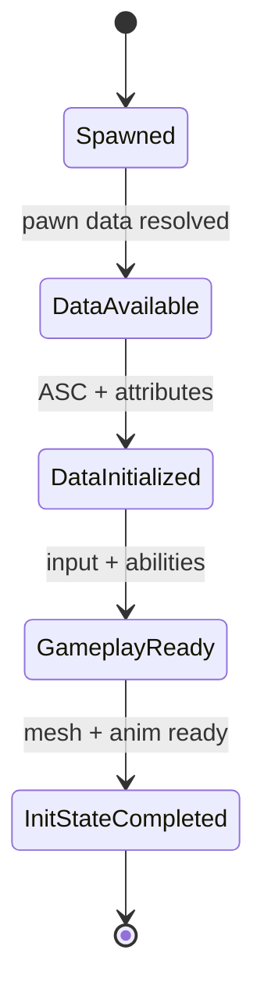
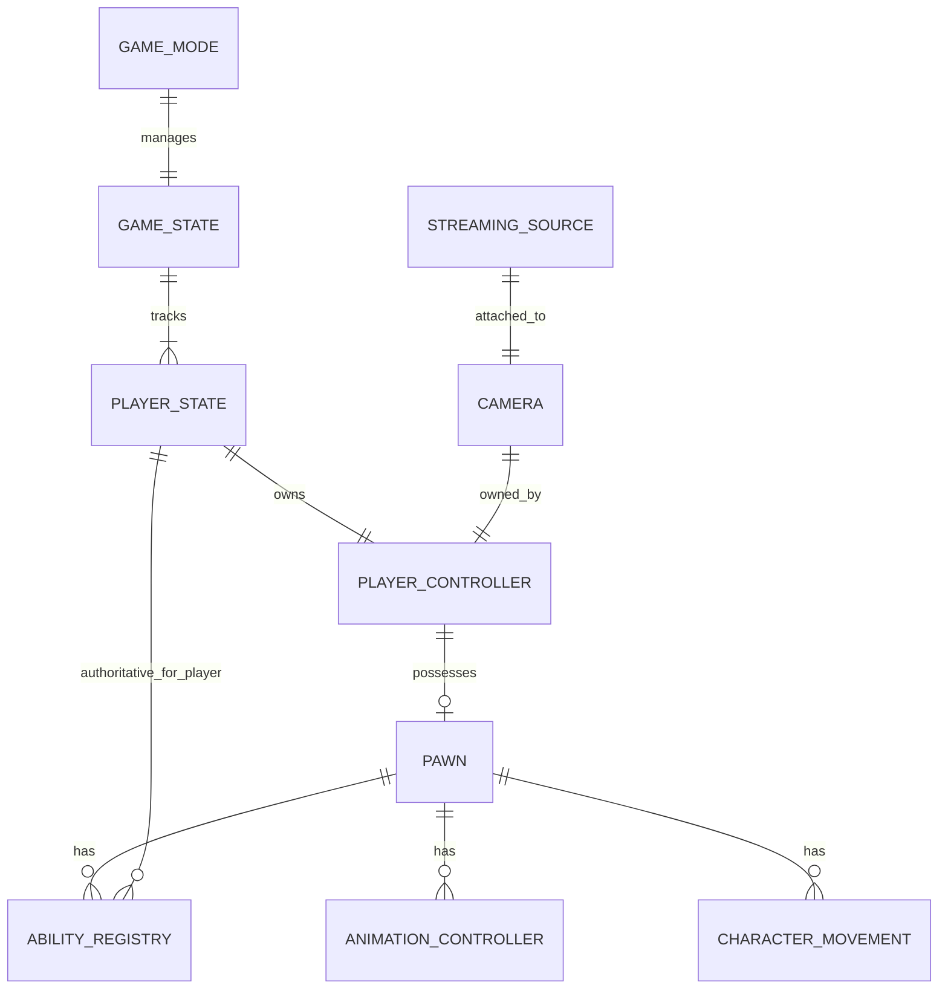
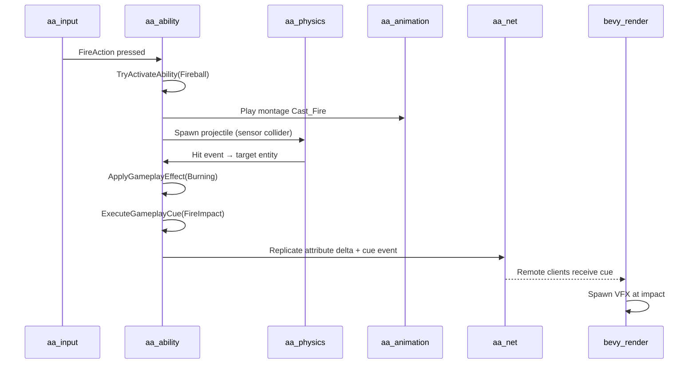
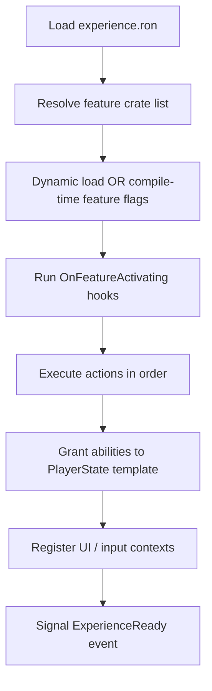
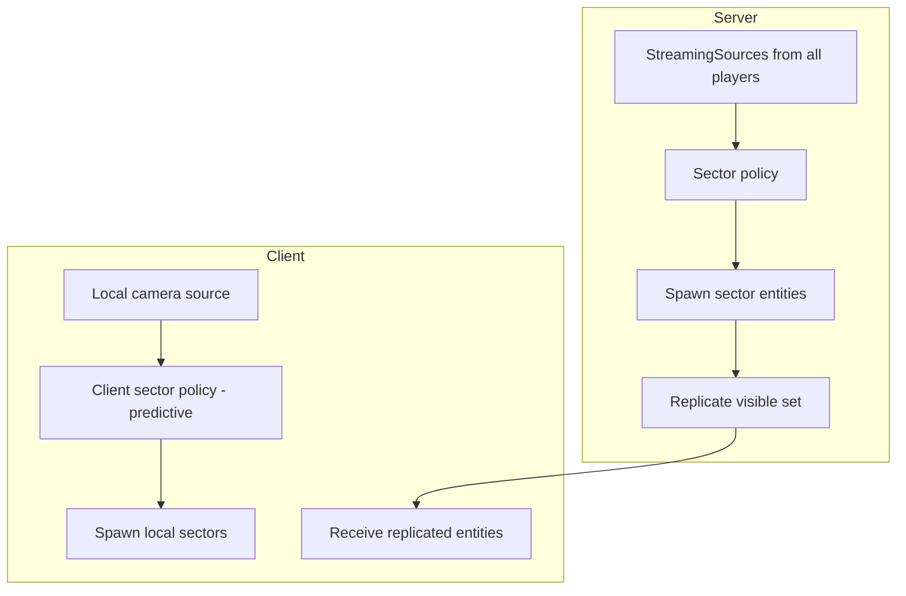
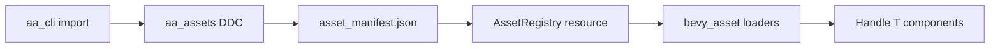
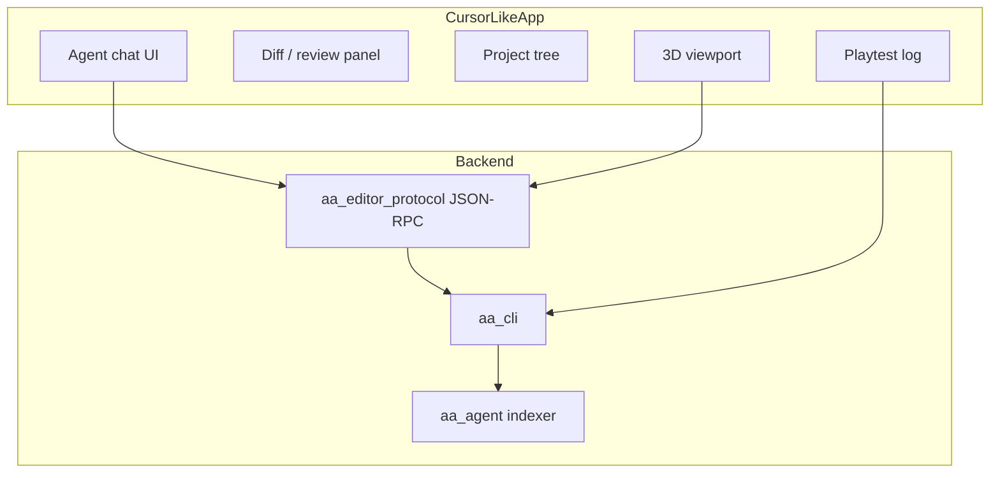

# 12 — Integration Blueprint

> **The wiring diagram.** How every `aa_*` crate connects from app boot through multiplayer play. Read this before writing code.

## North Star

You are building **one runtime** with three entry points:

| Binary | Purpose | Features |
|--------|---------|----------|
| `aa_game` | Shipped game | `default` |
| `aa_server` | Dedicated server | `server` |
| `aa_editor` | Cursor-like studio | `editor` + `dev` |

All three share `aa_core` and the same ECS world model. The editor is not a separate engine.



---

## Application Boot Sequence

Mirror UE5's: **Engine init → load config → register plugins → load map/experience → begin play**.

### Phase A — Engine boot (all binaries)

```
1. panic hook + tracing subscriber (aa_core::diagnostics)
2. load config layers (aa_core::config) — see 13_data_schemas.md
3. apply scalability preset (aa_render or aa_core)
4. build App + DefaultPlugins subset
5. add AaCorePlugin
6. add domain plugins in dependency order (below)
7. register schedules (14_system_schedule_spec.md)
8. load asset manifest (aa_assets)
```

### Phase B — Game boot (game + editor play mode)

```
9.  resolve ExperienceId from aa.project.toml or CLI
10. ExperienceLoader mounts feature plugins (aa_experience)
11. GameFeatureActions execute (grant abilities, register UI)
12. GameMode resource initialized (server only for rules)
13. load startup map / world sectors
14. spawn GameState singleton
15. for each player connection: spawn PlayerState + Controller
16. possession: Controller → Pawn
17. set InitState chain on pawn (Lyra pattern)
18. transition to Playing
```

### Phase C — Editor boot (editor only)

```
9.  EditorSession resource (editing, not playing)
10. load last open scene from .aa/session.toml
11. start JSON-RPC agent server (aa_editor_protocol)
12. optional: file watcher for hot reload
```

### Lyra init state machine (mapped)

UE5 Lyra uses `IGameFrameworkInitStateInterface` on pawn components. Map to explicit ECS state:

| UE5 init state | Bevy component field |
|----------------|---------------------|
| `Spawned` | `InitState(Spawned)` |
| `DataAvailable` | pawn data asset loaded |
| `DataInitialized` | ASC + attributes ready |
| `GameplayReady` | input + abilities wired |
| `InitStateCompleted` | remove `PendingInit` marker |



**Rule:** Systems that need fully-initialized pawns query `Without<PendingInit>`.

---

## Plugin Registration Order

**Critical:** Register in this order to satisfy dependencies.

```rust
// Conceptual — canonical plugin order
app
    .add_plugins(AaCorePlugin)           // config, cvar, schedules
    .add_plugins(AaReflectPlugin)        // type registry
    .add_plugins(AaAssetsPlugin)           // loaders, manifest, DDC
    .add_plugins(AaTagsPlugin)             // tag dictionary
    .add_plugins(AaScenePlugin)            // prefabs, hierarchy
    .add_plugins(AaInputPlugin)            // mapping contexts
    .add_plugins(AaAbilityPlugin)          // ASC components, effects
    .add_plugins(AaPhysicsPlugin)          // rapier + character
    .add_plugins(AaAnimationPlugin)        // anim graph
    .add_plugins(AaGameplayPlugin)         // game mode, possession
    .add_plugins(AaExperiencePlugin)       // experience loader
    .add_plugins(AaWorldStreamPlugin)      // sector streaming (if open world)
    .add_plugins(AaNetPlugin)              // replication (if networked)
    .add_plugins(AaRenderPlugin)           // scalability, post (extensions)
    .add_plugins(AaEditorPlugin)           // feature = "editor" only
    .add_plugins(AaAgentPlugin);           // feature = "editor" or CI only
```

---

## Entity Graph — Full Match Topology

Every multiplayer match should spawn this **entity graph**:



### Spawn responsibilities

| Entity | Spawner | Components (minimum) |
|--------|---------|---------------------|
| GameState | Server at match start | `GameState`, match timers, scores |
| PlayerState | Server per connection | `PlayerState`, `PlayerId`, `AbilityRegistry`, `GameplayTags` |
| PlayerController | Server per connection | `Controller`, `PlayerInput`, `Possesses` relationship |
| Pawn | Server on possess | `Pawn`, `Transform`, `CharacterMovement`, `Mesh`, `AbilityUser` |
| Camera | Client per local player | `Camera3d`, `StreamingSource` |

**Lyra rule preserved:** ASC lives on **PlayerState** for human players.

---

## Data Flow — One Combat Hit End-to-End

Trace one fireball hit across crates:



### Crate touchpoints per step

| Step | Crate | Key type |
|------|-------|----------|
| Input | `aa_input` | `InputAction::Fire` |
| Activation | `aa_ability` | `AbilityRegistry::try_activate` |
| Montage | `aa_animation` | `AnimEvent::PlayMontage` |
| Projectile | `aa_physics` | `Projectile` component |
| Effect | `aa_ability` | `GameplayEffectAsset` |
| Cue | `aa_ability` | `GameplayCueEvent` |
| Replicate | `aa_net` | `Replicated<Health>` + `CueRpc` |

---

## Experience + Game Feature Integration

From Lyra `ULyraExperienceDefinition` (`Samples/Games/Lyra/.../LyraExperienceDefinition.h`):

| UE5 field | Bevy equivalent |
|-----------|-----------------|
| `GameFeaturesToEnable` | `features: ["shooter_core", "inventory"]` in experience RON |
| `DefaultPawnData` | `default_pawn: "pawns/hero"` |
| `Actions` | `actions: [...]` inline |
| `ActionSets` | `action_sets: ["actions/shooter_base"]` |

### Load sequence



**MVP shortcut:** Use Cargo features instead of dynamic DLL load:

```toml
# aa.project.toml
[features]
enabled = ["feature_shooter_core"]
```

**AA path:** `libloading` of `feature_*.so` with stable `GameFeaturePlugin` trait.

---

## World + Streaming + Net Combined

For open-world multiplayer:



**Rules:**
1. **Server** owns sector activation for gameplay-critical entities
2. **Client** may pre-stream cosmetic sectors
3. Relevancy graph intersects sector visibility with connection set
4. PlayerState always relevant (Lyra ReplicationGraph lesson)

---

## Editor ↔ Runtime Bridge

| Editor action | Runtime effect |
|---------------|----------------|
| Move entity gizmo | `Transform` component patch |
| Edit RON ability | hot reload `Assets<GameplayEffect>` |
| Save scene | write `scenes/level_01.ron` |
| Play | `EditorSession` → `PlaySession`; clone world or reset |
| Stop | despawn play entities; restore editor scene |

**Single App pattern (recommended MVP):**

```rust
#[derive(Resource, Default)]
enum SessionMode {
    #[default]
    Editing,
    Playing,
}
```

Systems gate on `SessionMode::Playing` vs `Editing`.

---

## Config Propagation

From UE `ConfigHierarchy.h` — 10 layers. Our 6-layer subset:

```
engine_base.toml
  → engine.toml (project)
    → platform/{platform}.toml
      → game.toml
        → user.toml (gitignored)
          → CLI overrides (--cvar)
```

Every subsystem reads through `ConfigProvider::get("net.server_port")`.

---

## Asset Pipeline Integration



**Agent rule:** All gameplay tuning in RON under `assets/data/`; code only wires systems.

---

## Cross-Crate Event Bus

Use Bevy `Event` types as the **narrow waist** between crates:

| Event | Publisher | Consumers |
|-------|-----------|-----------|
| `ExperienceReady` | `aa_experience` | `aa_gameplay`, `aa_ui` |
| `PossessionChanged` | `aa_gameplay` | `aa_input`, `aa_animation` |
| `AbilityActivated` | `aa_ability` | `aa_animation`, `aa_net` |
| `GameplayCueEvent` | `aa_ability` | VFX, audio, `aa_net` |
| `SectorLoaded` | `aa_world_stream` | `aa_nav`, `aa_physics` |
| `DamageApplied` | `aa_ability` | UI, stats, `aa_net` |

**Avoid:** Direct crate-to-crate function calls across domain boundaries.

---

## Cursor-Like App Shell

Your product is **editor + agent**, not just engine:



See `17_agent_cli_contract.md` for command surface.

---

## Integration Checklist (before each phase)

### Phase 0 exit
- [ ] All plugins register without panic
- [ ] Config loads and CVars apply
- [ ] Prefab spawns from RON
- [ ] Schedule order matches spec doc 14

### Phase 1 exit
- [ ] Experience loads and fires `ExperienceReady`
- [ ] Input → ability → effect chain works
- [ ] Init state machine completes on pawn
- [ ] Animation montage fires on ability

### Phase 2 exit
- [ ] 8 players replicate transforms + health
- [ ] Sector load/unload with players moving
- [ ] Relevancy graph limits bandwidth

### Phase 3 exit
- [ ] Agent can `scene inspect` + `validate` + `playtest`
- [ ] Editor play/stop preserves scene

---

## Related Documents

| Topic | Doc |
|-------|-----|
| Schemas | `13_data_schemas.md` |
| Schedules | `14_system_schedule_spec.md` |
| Bootstrap | `15_phase0_bootstrap_guide.md` |
| Anti-patterns | `16_anti_patterns_and_decisions.md` |
| Agent API | `17_agent_cli_contract.md` |
