# 14 — System Schedule Specification

> **Canonical Bevy schedule ordering.** Wrong order = prediction bugs, animation foot slide, double physics. Treat this as law.

## Schedule Overview

```mermaid
flowchart TB
    subgraph First["First — once per frame setup"]
        F1[aa_core::frame_start]
    end

    subgraph PreUpdate
        PU1[config_cvar_apply]
        PU2[net_receive]
        PU3[input_gather]
        PU4[input_map_to_actions]
        PU5[ability_input_buffer]
    end

    subgraph FixedPrePhysics
        FPP1[character_movement_intent]
        FPP2[ability_activation_tick]
    end

    subgraph FixedUpdate["FixedUpdate (60 Hz)"]
        FU1[physics_step]
        FU2[projectile_movement]
        FU3[effect_periodic_tick]
        FU4[crowd_processors]
    end

    subgraph FixedPostPhysics
        FPO1[root_motion_apply]
        FPO2[transform_propagation]
    end

    subgraph Update
        U1[init_state_machine]
        U2[animation_graph_eval]
        U3[gameplay_cue_spawn]
        U4[world_stream_policy]
        U5[camera_follow]
    end

    subgraph PostUpdate
        PO1[world_stream_apply]
        PO2[net_send]
        PO3[interpolation]
        PO4[ability_cooldown_ui]
    end

    subgraph Last["Last"]
        L1[diagnostics_frame_end]
    end

    First --> PreUpdate --> FixedPrePhysics --> FixedUpdate
    FixedUpdate --> FixedPostPhysics --> Update --> PostUpdate --> Last
```



---

## Schedule Labels (register in `aa_core`)

Define explicit `SystemSet` hierarchy:

```rust
// Conceptual — all aa_* plugins configure into these sets
#[derive(SystemSet, Debug, Clone, PartialEq, Eq, Hash)]
pub enum AaSchedule {
    FrameStart,
    // PreUpdate
    Input,
    NetReceive,
    AbilityInput,
    // Fixed
    MovementIntent,
    AbilityFixed,
    Physics,
    Effects,
    Crowd,
    RootMotion,
    // Update
    InitState,
    Animation,
    GameplayCues,
    WorldStream,
    Camera,
    // PostUpdate
    WorldStreamApply,
    NetSend,
    Interpolation,
    // Last
    FrameEnd,
}
```

---

## Detailed System Tables

### `First` — once at frame start

| System | Crate | Reads | Writes |
|--------|-------|-------|--------|
| `frame_counter` | `aa_core` | — | `FrameIndex` resource |
| `time_scale_apply` | `aa_core` | `TimeScale` | `Time<Virtual>` |

### `PreUpdate`

| Order | System | Crate | Notes |
|-------|--------|-------|-------|
| 1 | `config_hot_reload` | `aa_core` | Editor/dev only |
| 2 | `net_receive_packets` | `aa_net` | Before prediction |
| 3 | `net_apply_server_corrections` | `aa_net` | Character only |
| 4 | `gather_raw_input` | `aa_input` | Keyboard/mouse/gamepad |
| 5 | `resolve_mapping_contexts` | `aa_input` | Stack by priority |
| 6 | `emit_action_events` | `aa_input` | `ActionEvent` bus |
| 7 | `buffer_ability_input` | `aa_ability` | Queue for fixed tick |

**UE analog:** PlayerController input before pawn tick.

### `FixedPrePhysics` (run at 60 Hz)

| Order | System | Crate | Notes |
|-------|--------|-------|-------|
| 1 | `apply_movement_intent` | `aa_physics` | Wish dir → `CharacterMovement` |
| 2 | `try_activate_abilities` | `aa_ability` | Consumes buffered input |
| 3 | `ability_task_fixed_tick` | `aa_ability` | Active ability tasks |

### `FixedUpdate`

| Order | System | Crate | Notes |
|-------|--------|-------|-------|
| 1 | `rapier_physics_step` | `aa_physics` | `bevy_rapier` configured here |
| 2 | `projectile_system` | `aa_physics` | Sensors, hit events |
| 3 | `effect_duration_tick` | `aa_ability` | DoT, expire effects |
| 4 | `attribute_recalc` | `aa_ability` | Aggregation pass |
| 5 | `crowd_movement` | `aa_crowd` | Mass processors (AA) |

**UE analog:** `TG_PrePhysics` → `TG_DuringPhysics`

### `FixedPostPhysics`

| Order | System | Crate | Notes |
|-------|--------|-------|-------|
| 1 | `apply_root_motion` | `aa_animation` | From anim eval cache |
| 2 | `sync_physics_to_transform` | `aa_physics` | Kinematic bodies |
| 3 | `propagate_transforms` | Bevy built-in | After all movement |

### `Update`

| Order | System | Crate | Notes |
|-------|--------|-------|-------|
| 1 | `pawn_init_state_machine` | `aa_gameplay` | Lyra init chain |
| 2 | `possession_sync` | `aa_gameplay` | Controller ↔ pawn |
| 3 | `animation_graph_eval` | `aa_animation` | Parallel per skeletal mesh |
| 4 | `process_gameplay_cues` | `aa_ability` | Spawn VFX/audio |
| 5 | `world_stream_eval_policy` | `aa_world_stream` | Compute sector diff |
| 6 | `camera_system` | `aa_gameplay` | Spring arm / FPS |
| 7 | `game_mode_rules` | `aa_gameplay` | Server only |

**UE analog:** `TG_PostPhysics` + component tick

### `PostUpdate`

| Order | System | Crate | Notes |
|-------|--------|-------|-------|
| 1 | `world_stream_load_unload` | `aa_world_stream` | Async IO kick |
| 2 | `world_stream_spawn_despawn` | `aa_world_stream` | Apply loaded sectors |
| 3 | `net_relevancy_graph` | `aa_net` | Per-connection sets |
| 4 | `net_send_replication` | `aa_net` | Serialize deltas |
| 5 | `interpolate_remote_entities` | `aa_net` | Simulated proxies |
| 6 | `cooldown_sync_ui` | UI crate | HUD updates |

### `Last`

| System | Crate |
|--------|-------|
| `trace_frame_end` | `aa_core` |
| `playtest_assertions` | `aa_agent` (CI) |

---

## Server vs Client Schedule Differences

| System | Server | Client |
|--------|--------|--------|
| `game_mode_rules` | ✅ | ❌ |
| `net_receive` | ✅ | ✅ |
| `net_send` | ✅ | ✅ |
| `try_activate_abilities` | ✅ authoritative | ✅ predicted (local player only) |
| `interpolate_remote_entities` | ❌ | ✅ |
| `world_stream_policy` | ✅ authoritative layers | ✅ predictive cosmetic |

Use `aa_core::AppRole` resource:

```rust
enum AppRole { DedicatedServer, Client, ListenServer, Editor }
```

Systems use `run_if(in_state(ServerOnly))` patterns.

---

## Parallelization Rules

| System | Parallel? | Condition |
|--------|-----------|-----------|
| `animation_graph_eval` | ✅ | One task per `AnimationController` |
| `crowd_movement` | ✅ | Mass archetype batches |
| `attribute_recalc` | ⚠️ | Parallel per ASC, not same entity |
| `try_activate_abilities` | ❌ | Ordering matters |
| `net_send` | ❌ | Single writer per connection |

---

## Event Ordering Guarantees

Events flushed same-frame in emission order:

| Emitter | Event | Consumer same frame? |
|---------|-------|---------------------|
| `aa_input` | `ActionEvent::Fire` | Buffered → next `FixedPrePhysics` |
| `aa_physics` | `CollisionEvent` | `aa_ability` in next `FixedUpdate` |
| `aa_ability` | `GameplayCueEvent` | `aa_animation`/VFX in `Update` |
| `aa_world_stream` | `SectorLoaded` | `aa_nav` next `Update` |

**Rule:** Cross-schedule reactions use events, not direct system calls.

---

## Startup Schedule (one-shot)

```rust
app.add_systems(Startup, (
    load_config,
    init_asset_registry,
    load_tag_dictionary,
    load_experience,
    setup_game_mode,
    spawn_game_state,
).chain());
```

On client connect (server):

```rust
// OnConnect event chain
spawn_player_state → spawn_controller → load_pawn_data → spawn_pawn → begin_possession → init_state
```

---

## Editor Mode Gating

When `SessionMode::Editing`:

| Disabled systems | Reason |
|------------------|--------|
| `net_*` | No network in edit |
| `game_mode_rules` | No match logic |
| `ability_activation` | Optional — only in play |
| `world_stream_policy` | Manual scene load |

When `SessionMode::Playing` — full schedule active.

---

## Diagnostics: Schedule Violations

Log warnings in dev builds:

| Violation | Detection |
|-----------|-----------|
| Ability modifies transform after physics | System order audit |
| Effect applied before attribute init | `InitState` query miss |
| Replication before game state spawn | Assert on `GameState` exists |
| Sector spawn after net send same frame | Ordering assert |

---

## Migration from Default Bevy

Bevy `DefaultPlugins` already registers transforms, Rapier (if added), etc.

**Insert aa systems:**
- *before* `TransformSystem::Propagate` → movement intent
- *with* `FixedUpdate` → physics at same timestep
- *after* `TransformSystem::Propagate` → camera

Document exact `before/after` targets when pinning Bevy version.

---

## Quick Reference Card

```
INPUT  → PreUpdate
INTENT → FixedPrePhysics
PHYSICS → FixedUpdate
ROOT MOTION → FixedPostPhysics
ANIM   → Update
STREAM → PostUpdate
NET    → PreUpdate receive, PostUpdate send
```

---

*Order derived from UE tick groups (`TG_PrePhysics`, `TG_DuringPhysics`, `TG_PostPhysics`) mapped to Bevy schedules.*
