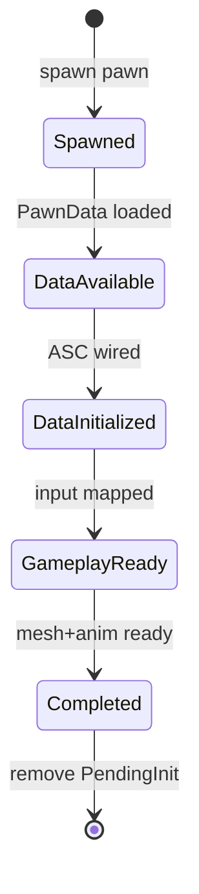

# aa_gameplay — Subsystem Specification

> **Normative** | Priority P1 | Depends: `aa_scene`, `aa_core`, `aa_ability`

## Scope

### In scope
- GameMode, GameState, PlayerState, Controller, Pawn archetypes
- Possession system
- Pawn init state machine (Lyra `IGameFrameworkInitStateInterface`)
- Spawn points, respawn, team ID

### Out of scope
- Ability logic (aa_ability)
- Network transport (aa_net)

## UE5 Reference
- `GameModeBase.h`, `GameStateBase.h`, `PlayerState.h`, `Controller.h`, `Pawn.h`
- `Samples/Games/Lyra/.../LyraPawnExtensionComponent.h`
- `Samples/Games/Lyra/.../LyraExperienceManagerComponent.h`

---

## Requirements

| ID | Requirement |
|----|-------------|
| REQ-GAME-001 | `GameMode` resource MUST exist only on server role |
| REQ-GAME-002 | `GameState` MUST be singleton per match |
| REQ-GAME-003 | One `PlayerState` entity MUST spawn per player connection on server |
| REQ-GAME-004 | One `PlayerController` entity MUST spawn per player on server |
| REQ-GAME-005 | `Possesses` relationship MUST link Controller → Pawn when possessed |
| REQ-GAME-006 | On pawn death, Controller MUST unpossess; PlayerState MUST persist |
| REQ-GAME-007 | Respawn MUST spawn new pawn and re-possess same Controller |
| REQ-GAME-008 | `TeamId` component MUST be on PlayerState and Pawn |
| REQ-GAME-010 | Init state MUST progress: Spawned → DataAvailable → DataInitialized → GameplayReady → Completed |
| REQ-GAME-011 | `PendingInit` marker MUST be removed only at Completed |
| REQ-GAME-012 | Systems requiring ready pawns MUST use `Without<PendingInit>` |
| REQ-GAME-013 | Default pawn spawn MUST use `PawnData` asset from experience |
| REQ-GAME-014 | Spawn points MUST be discovered via `SpawnPoint` component query |
| REQ-GAME-015 | `ExperienceReady` event MUST gate player spawning |
| REQ-GAME-016 | `PawnData` assets MUST validate against `schemas/pawn_data.schema.json` |
| REQ-GAME-017 | `PawnData` soft refs for mesh, animation, attributes, and input contexts MUST resolve before spawn |
| REQ-GAME-018 | `PawnData.attribute_sets` MUST reference assets that validate against `schemas/attribute_set.schema.json` |

---

## API Contract

```rust
#[derive(Resource)]
pub struct GameMode {
    pub experience_id: ExperienceId,
    pub respawn_delay_secs: f32,
}

#[derive(Resource, Default)]
pub struct GameState {
    pub match_time_secs: f32,
    pub phase: MatchPhase,
}

#[derive(Component)]
pub struct PlayerState {
    pub player_id: u32,
    pub display_name: String,
}

#[derive(Component)]
pub struct Controller {
    pub player_id: u32,
}

#[derive(Component)]
pub struct Pawn;

#[derive(Component)]
pub struct PendingInit {
    pub state: InitState,
}

#[derive(Clone, Copy, PartialEq, Eq)]
pub enum InitState {
    Spawned,
    DataAvailable,
    DataInitialized,
    GameplayReady,
    Completed,
}

#[derive(Component)]
pub struct TeamId(pub u8);

#[derive(Component)]
pub struct SpawnPoint {
    pub team: u8,
    pub tag: String,
}

#[derive(Event)]
pub struct ExperienceReady {
    pub experience_id: ExperienceId,
}

#[derive(Event)]
pub struct PossessionChanged {
    pub controller: Entity,
    pub pawn: Option<Entity>,
}
```

---

## Init State Machine



| Transition | System | Crate |
|------------|--------|-------|
| → DataAvailable | `pawn_data_load_system` | `aa_gameplay` |
| → DataInitialized | `asc_wire_system` | `aa_ability` |
| → GameplayReady | `input_bind_system` | `aa_input` |
| → Completed | `anim_ready_system` | `aa_animation` |

---

## Test Matrix

| ID | Scenario | Expected | Auto |
|----|----------|-------|------|
| T-GAME-01 | Player join | PlayerState + Controller spawned | integration |
| T-GAME-02 | Possession | Possesses edge exists | integration |
| T-GAME-03 | Pawn death | PlayerState exists, pawn despawned | integration |
| T-GAME-04 | Respawn | new pawn possessed | integration |
| T-GAME-05 | Init chain | PendingInit removed ≤ 10 frames | integration |
| T-GAME-06 | GameMode server only | no GameMode on client | unit |
| T-GAME-07 | PawnData schema | malformed pawn asset rejected | unit |
| T-GAME-08 | PawnData refs | missing mesh/input ref returns `REF_MISSING` | integration |

---

## Acceptance

**P1 certified when:** T-GAME-01–08 green + Gate P1-07 PASS.
